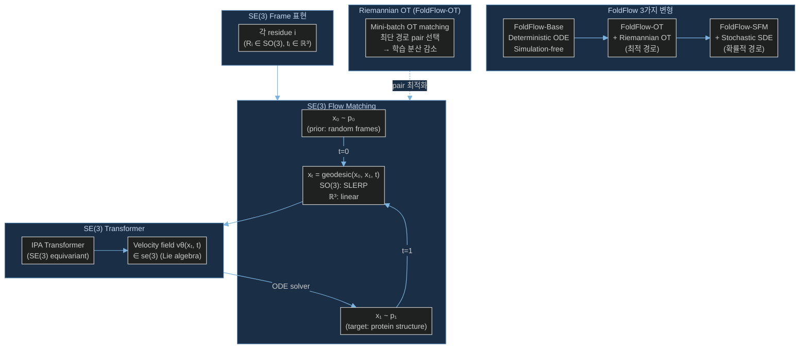

# Paper — FoldFlow: SE(3)-Stochastic Flow Matching for Protein Backbone Generation

## 메타

- **저자**: Avishek Joey Bose, Tara Akhound-Sadegh, Kilian Fatras, Guillaume Huguet, et al.
- **Venue / Year**: ICLR 2024 Spotlight
- **Link**: https://arxiv.org/abs/2310.02391
- **GitHub**: https://github.com/DreamFold/FoldFlow
- **Tier**: ⭐ Must-cite
- **원본 노트**: [[../../../../3_Resources/Papers/Paper_Bose23_FoldFlow]]

## TL;DR (3줄)

1. SE(3) 위에서 Flow Matching을 수행하는 FoldFlow 시리즈 제안 (Base / OT / SFM).
2. Riemannian Optimal Transport로 더 단순하고 안정적인 flow 경로 학습.
3. Diffusion 대비 훈련 안정성↑, 샘플링 속도↑ — 최대 300 residue 생성.

## 핵심 아키텍처

## 핵심 아이디어

- **표현**: SE(3) frames (FrameDiff와 동일), NERF 없음
- **Flow**: SO(3)에서 SLERP geodesic interpolation, ℝ³에서 linear interpolation
- **OT**: Mini-batch Riemannian OT로 x₀-x₁ pair 최적화 → flow 경로 단순화, 학습 분산 감소
- **Velocity**: Lie algebra se(3) = so(3) ⊕ ℝ³에서 예측

## 우리 연구와의 연결 고리

- CrypticFlow도 flow matching 기반 → FoldFlow의 SE(3) 구현이 장기 전환 방향의 직접 레퍼런스
- Riemannian flow matching 실험을 CrypticFlow에서 torsion angle 공간에서 시도했으나 실패 → SE(3)에서 제대로 적용해야 함
- FoldFlow-OT의 Riemannian OT 개념이 데이터 pair 선택에도 적용 가능

## 인용할 만한 문장

> "FoldFlow generative models are more stable and faster to train than diffusion-based approaches"

## 추가로 읽을 참고문헌

- [ ] [[1_Projects/Crypticflow/Reading_Notes/Paper_Sesame25_ApoHolo]] — 동일 SE(3) 방식으로 apo→holo task
- [ ] [[1_Projects/Crypticflow/Reading_Notes/Paper_Yim23_FrameDiff]] — SE(3) diffusion (FoldFlow의 비교 대상)
