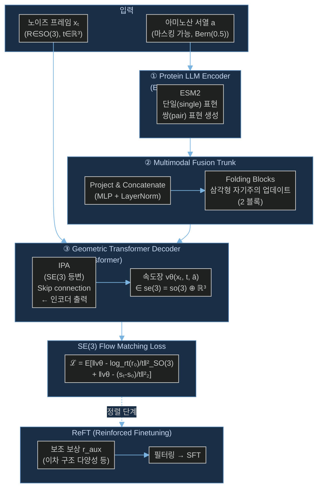

# Paper — FoldFlow-2: Sequence-Augmented SE(3)-Flow Matching for Conditional Protein Backbone Generation

## 메타

- **저자**: Guillaume Huguet, James Vuckovic, Kilian Fatras, Ediz Dzamba, David Shalloway, Avishek Joey Bose, Yoshua Bengio et al. (12명)
- **Venue / Year**: NeurIPS 2024
- **Link**: https://arxiv.org/abs/2405.20313
- **Code**: https://github.com/DreamFold/FoldFlow (FoldFlow 시리즈 공개)
- **Tier**: Should-cite
- **관련 프로젝트**: [[../../README]]

## TL;DR (3줄)

1. 서열(sequence) 정보를 SE(3) flow matching에 통합한 FoldFlow-2 제안 — protein LLM encoder + multimodal fusion trunk + geometric transformer decoder 3단 구조.
2. ReFT(Reinforced Finetuning)로 임의의 보상 함수(이차 구조 다양성 등)에 맞게 모델 정렬 가능.
3. RFDiffusion 대비 Novelty +25.2%p 절대 개선, PDB+합성 데이터 160K 구조(이전 대비 8×) 규모 학습.

## 핵심 아키텍처

## 문제 정의 (Problem)

- 기존 단백질 백본 생성 모델(RFDiffusion, FrameDiff, FoldFlow)은 **서열 정보를 조건으로 활용하지 않거나** 매우 제한적으로 사용함.
- 생물학적 사실: 단백질 3D 구조는 아미노산 서열에 의해 결정됨 — 이 귀납적 편향을 생성 모델에 주입하면 품질이 올라야 함.
- 기존 모델은 **Novelty(신규성)** 가 낮음 — 새로운 fold를 거의 생성하지 못함.
- 사용자 정의 속성(이차 구조 비율 등)으로 생성 방향을 제어하는 표준 방법이 없음.

## 핵심 아이디어 (Method)

### 1. 3단 아키텍처

| 모듈 | 역할 | 세부 |
|------|------|------|
| Protein LLM Encoder | 서열 인코딩 | ESM2 650M, single + pair 표현 생성 |
| Multimodal Fusion Trunk | 서열-구조 융합 | Project & Concat (MLP+LN) → Folding Blocks (삼각형 self-attn), 2블록 |
| Geometric Transformer Decoder | 구조 생성 | IPA Transformer, skip connection from encoder |

- 인코더-디코더 간 **skip connection** 이 성능에 필수적 (ablation으로 확인).
- 전체 아키텍처 블록 배분: 인코더 2 + 트렁크 2 + 디코더 2.

### 2. SE(3) Flow Matching

$$\mathcal{L} = \mathbb{E}\left[\left\|\mathbf{v}_\theta - \frac{\log_{r_t}(r_0)}{t}\right\|^2_{SO(3)} + \left\|\mathbf{v}_\theta - \frac{s_t - s_0}{t}\right\|^2_2\right]$$

- 회전 손실: SO(3) 위에서 로그 맵(log map)을 사용한 geodesic 속도 예측.
- 평행이동 손실: ℝ³에서 선형 보간 속도.
- 서열 마스킹: $\bar{a} = a \odot m$, $m \sim \text{Bern}(0.5)$ → 조건부/비조건부 생성 동시 학습.

### 3. ReFT (Reinforced Finetuning)

$$\max_{p_\theta} \mathcal{L}_{\text{ReFT}}(\theta) = \mathbb{E}_{(x,a)\sim\mathcal{D}_{\text{pref}}}\left[r_{\text{aux}}(x)\log p_\theta(x|a)\right]$$

단계:
1. 보조 보상 $r_{\text{aux}}$ 가 있는 단백질 데이터셋 선별 (예: 이차 구조 다양성 점수).
2. 보상으로 점수 매기고 상위 데이터 필터링.
3. 필터된 부분집합으로 supervised finetuning.

### 4. 학습 데이터

- **총 160K 구조** (PDB + AlphaFold2 합성 필터링, SwissProt 기반).
- 훈련 중 합성 샘플 비율: **2/3** (과적합 방지).
- 이전 FoldFlow 대비 약 **8배** 증가.

## 실험 결과 (Results)

| 모델 | Designability (scRMSD<2Å) | Novelty (TM<0.3 비율) | Pairwise TM (낮을수록↓) |
|------|--------------------------|----------------------|------------------------|
| **FoldFlow-2** | **97.6%** | **36.8%** | **0.205** |
| RFDiffusion | 96.9% | 11.6% | 0.256 |
| FrameDiff | ~85% | ~10% | ~0.30 |

- Novelty 절대 +25.2%p, Diversity 상대 +19.9~102.3% 개선.
- VHH 나노바디 스캐폴드 설계 등 조건부 생성 태스크도 입증.

## 강점 / 약점

**Strengths**

- 서열 조건부 생성으로 생물학적 현실성 높임.
- ReFT로 임의 보상 정렬 — 실용적 단백질 공학에 유용.
- 대규모 합성 데이터 활용으로 Novelty 대폭 향상.
- FoldFlow 시리즈 (Base/OT/SFM) 위에 자연스럽게 쌓인 발전.

**Weaknesses**

- ESM2 650M encoder 고정(frozen) 사용 — end-to-end 공동 학습 아님.
- ReFT가 RL이 아닌 필터링 기반 SFT → 보상 최대화 보장 약함.
- 최대 길이 한계 (300 residue 수준, Proteina의 800과 비교).
- 합성 데이터 품질 의존도 높음 (AlphaFold2 hallucination 위험).

## 우리 연구와의 연결 고리

- **문제 1 (Loss-RMSD 불일치)**: FoldFlow-2의 SE(3) 손실 수식 (SO(3) log map + ℝ³ 선형)은 NERF angle-space 손실 대비 구조 공간과 일치하는 metric 사용 → CrypticFlow의 loss 재설계 방향 참조. 현재 CrypticFlow의 torsion angle 손실이 실제 RMSD와 불일치하는 문제를 SE(3) 전환 시 해소 가능.
- **FoldFlow 시리즈 후속**: [[Paper_Bose23_FoldFlow]] (Base/OT/SFM) → FoldFlow-2로 이어지는 계보. CrypticFlow가 SE(3) 전환 시 FoldFlow-2 아키텍처가 직접 참조 기준점.
- **ESM-3 conditioning**: FoldFlow-2가 ESM2로 서열 조건부 생성을 구현했듯, CrypticFlow도 ESM-3 (1536-dim) conditioning을 사용 — 통합 방식(project & concat, skip connection)을 그대로 참조 가능.
- **ReFT 적용 가능성**: apo-holo 변화에서 pocket openness나 RMSD 보상으로 CrypticFlow를 정렬하는 데 ReFT 프레임워크 활용 가능.

## 인용할 만한 문장

> "FoldFlow-2 exploits a key biological inductive bias: protein 3D structure is determined by the amino acid sequence."

> "ReFT provides a general and lightweight recipe to align FoldFlow-2 to arbitrary rewards, such as secondary structure diversity."

## 추가로 읽을 참고문헌

- [ ] [[Paper_Bose23_FoldFlow]] — FoldFlow 원본 (SE(3) flow matching 기초)
- [ ] [[Paper_Yim23_FrameDiff]] — IPA Transformer (FoldFlow-2 decoder 베이스)
- [ ] [[Paper_NVIDIA25_Proteina]] — non-equivariant 대형 모델로 같은 문제 접근
