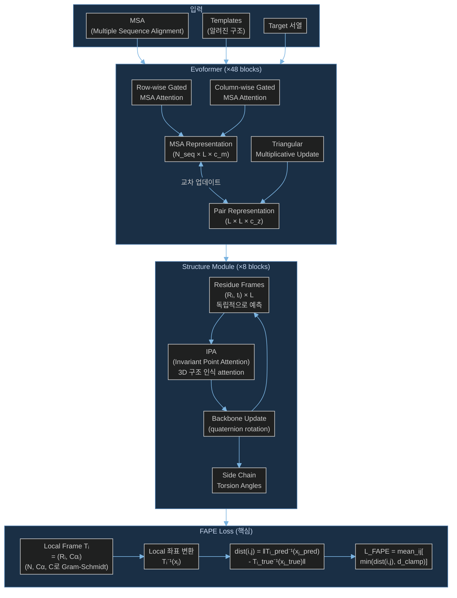

# Paper — AlphaFold2: Highly accurate protein structure prediction with AlphaFold

## 메타

- **저자**: John Jumper, Richard Evans, Alexander Pritzel, et al. (DeepMind)
- **Venue / Year**: Nature, 2021
- **Link**: https://www.nature.com/articles/s41586-021-03819-2
- **Tier**: ⭐ Must-cite
- **원본 노트**: [[../../../../3_Resources/Papers/Paper_Jumper21_AlphaFold2]]

## TL;DR (3줄)

1. Evoformer + Structure Module 구조로 MSA와 templates를 활용해 원자 수준 단백질 구조 예측.
2. **FAPE loss** 제안: 각 residue local frame 기준 좌표 오차 → lever arm effect 없이 안정적 3D 학습.
3. 각 residue frame을 독립적으로 예측 (peptide bond geometry 의도적으로 무시) → loop closure 불필요.

## 핵심 아키텍처

## 핵심 아이디어

- **FAPE**: 각 residue i의 local frame 기준으로 다른 residue j의 좌표 오차 측정 → global RMSD 대비 안정적
- **Independent frames**: Peptide bond constraint 의도적으로 위반 → 어떤 위치도 독립적으로 refinement 가능
- **d_clamp**: 이상치(outlier) gradient 제한 → 훈련 안정성 (OpenFold에서 sample 단위 clamping으로 개선)

## 우리 연구와의 연결 고리

- CrypticFlow의 FAPE 구현(`losses.py:291-333`)이 AlphaFold2 Eq. 4 참조
- CrypticFlow에서 FAPE + NERF backprop 조합이 weight=50에서 발산 → SE(3) 표현 없이는 FAPE gradient가 안정적이지 않음을 실험으로 확인
- **Must-cite**: FAPE loss 수식 인용

## 인용할 만한 문장

> "peptide bond geometry is completely unconstrained — breaking this constraint enables local refinement of all parts of the chain without solving complex loop closure problems"

## 추가로 읽을 참고문헌

- [ ] OpenFold — FAPE sample-level clamping 개선
- [ ] [[1_Projects/Crypticflow/Reading_Notes/Paper_Yim23_FrameDiff]] — FAPE를 생성 모델에 적용
