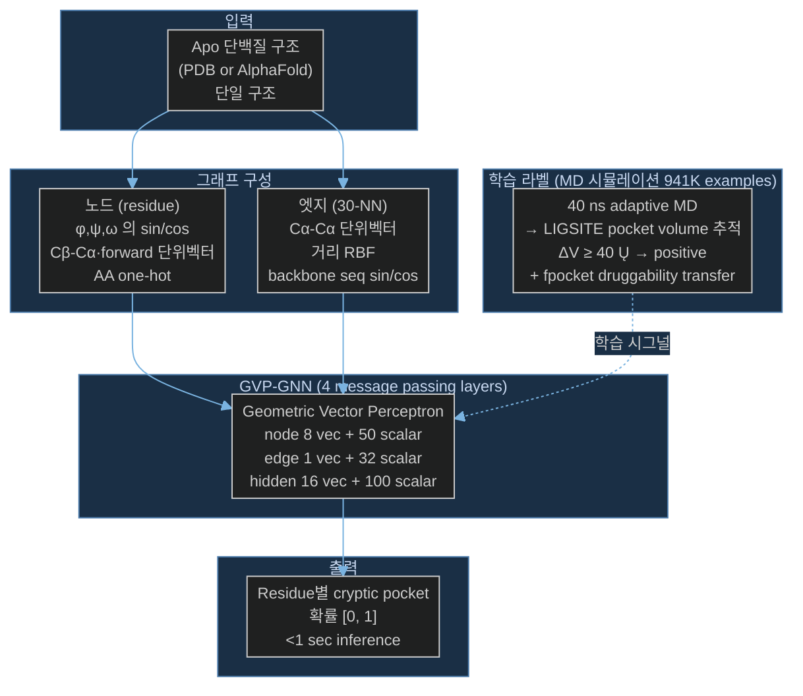

# Paper — PocketMiner: Predicting Cryptic Pocket Locations from Single Protein Structures using a Graph Neural Network

## 메타

- **저자**: Artur Meller, Michael Ward, Jonathan Borowsky, Meghana Kshirsagar, Jeffrey M. Lotthammer, Felipe Oviedo, Juan Lavista Ferres, Gregory R. Bowman et al.
- **Venue / Year**: Nature Communications **14**, 1177 (2023) — Published 1 March 2023
- **Link**: https://www.nature.com/articles/s41467-023-36699-3 | DOI: 10.1038/s41467-023-36699-3
- **Code**: Bowman lab GitHub — `bowman-lab/PocketMiner`
- **Tier**: ⭐ Must-cite (Project A의 핵심 baseline / motivation 보강)
- **관련 프로젝트**: [[../README]]

## TL;DR (3줄)

1. **GVP-GNN으로 단일 apo 구조에서 cryptic pocket 위치를 residue-단위 확률로 예측** — 기존 CryptoSite 대비 **>1000× 빠르고** ROC-AUC **0.87 (vs. 0.85)** 로 약간 더 정확.
2. 학습 데이터의 핵심 trick: 941K residue-frame examples를 MD 시뮬레이션으로부터 자동 라벨링 — 40 ns 윈도우에서 LIGSITE pocket volume이 **ΔV ≥ 40 Ų** 증가하는 residue를 positive로. "포켓이 실제로 형성되는 사건"을 직접 학습.
3. 인간 프로테옴(~10K genes)에 적용 → ground-state pocket이 없는 단백질의 약 60%가 cryptic pocket을 가질 가능성. **드러그어블 프로테옴이 ~50% → 80%+ 로 확대** 가능성 시사.

## 핵심 아키텍처

> 빠른 스케치는 **Mermaid** (호버 시 1.7배 확대).
> 줌·드래그로 깊이 들여다봐야 하는 핵심 논문은 **Excalidraw** 섹션도 함께 사용.

### Mermaid (빠른 스케치)

### Excalidraw (인터랙티브, 선택)

> **만드는 법** (Must-cite 논문이나 본인 paper figure에 쓸 다이어그램만):
> 1. `Cmd+P` → **"Excalidraw: Create new drawing in current folder"**
> 2. 새로 열린 캔버스 우상단 햄버거 메뉴 → **"Insert mermaid diagram"**
> 3. 위 Mermaid 코드 그대로 복붙 → 자동으로 Excalidraw 도형으로 변환
> 4. 필요 시 색·라벨 위치·강조 화살표 등을 손으로 다듬고 저장
> 5. 파일명 예: `Paper_Meller23_PocketMiner_arch.excalidraw` (이 노트와 같은 폴더에)

*(여기에 `![[Paper_Meller23_PocketMiner_arch.excalidraw]]` 형태로 임베드)*

마우스 휠 = zoom, 스페이스+드래그 = pan, 더블클릭 = 편집 모드.

## 문제 정의 (Problem)

**Cryptic pocket**: apo 구조에선 보이지 않지만 thermal fluctuation·conformational rearrangement로 동적으로 열려 ligand가 결합 가능한 포켓. 약물 발견 관점에서 "undruggable" target을 다시 그려낼 가능성을 가짐.

기존 방법의 한계:

- **실험적 발견** — 우연(serendipitous) 의존, 체계적이지 않음
- **MD 시뮬레이션** — 단백질당 수시간~수일 → 프로테옴 규모 적용 불가
- **CryptoSite** (Cimermancic 2016) — ROC-AUC 0.83이지만 MD-derived feature 입력 필요 → 단백질당 ~1일 소요, 여전히 느림

**요구사항**: AlphaFold 시대에 **단일 구조 입력 + 초 단위 inference**로 cryptic pocket 위치를 예측 + 프로테옴 규모 적용 가능.

## 핵심 아이디어 (Method)

**1. Training data 큐레이션 (이 논문의 가장 큰 기여)**

- 37 단백질 × ≥40 ns × 2,400+ MD trajectories
- 출처: Folding@home의 SARS-CoV-2 시뮬레이션 (Zimmerman 2021), Ebola VP35 (Cruz 2022), 신규 시뮬레이션한 16개 cryptic-pocket-known 단백질
- 라벨링: 각 40 ns 윈도우에서 **LIGSITE로 residue 근처 pocket volume 추적**, ΔV ≥ 40 Ų 시 positive
- **941,650 residue-level examples**
- Negatives: 강직한 designed microprotein + 광범위 약물 스크리닝에서 binding 안 한 site

**2. 모델 — GVP-GNN** (Jing et al. 2020 채용)

- **노드 (residue)**: backbone dihedral {sin, cos}{φ,ψ,ω}, Cβ-Cα 방향 단위벡터, forward 단위벡터, AA one-hot
- **엣지 (30-NN)**: Cα-Cα 단위벡터, 거리 RBF (Gaussian basis), 백본 sequential 거리 sinusoidal encoding
- 4 layers message passing, hidden 16 vec + 100 scalar
- 출력: residue별 [0, 1] cryptic pocket 확률

**3. Two-stage training**

- Stage 1: LIGSITE pocket-volume label로 20 epoch 학습 (Task 1: pocket-opening prediction)
- Stage 2: fpocket druggability score label로 추가 1 epoch transfer-learning → 최종 PocketMiner

**4. 평가용 신규 데이터셋 — "PocketMiner Dataset"**

- 38 apo-holo 쌍 / 39 cryptic pockets — CryptoSite의 93쌍보다 **큰 conformational change** 포함하도록 재큐레이션
- **4가지 pocket-formation 메커니즘** 분류:
  - **Forward** (loop/helix가 갈라져서 → ~70%)
  - **Reverse** (구조가 닫혀 lid/wall 형성 → ~30%)
  - Secondary structure 변환
  - 도메인 간 motion

## 실험 결과 (Results)

| 셋업 | 메트릭 | 값 |
|-----|--------|-----|
| Task 1 (sim pocket-opening 예측) | ROC-AUC | 0.83 ± 0.04 |
| Task 1 — 3D-CNN baseline | ROC-AUC | 0.79 ± 0.02 |
| Task 2 (실험 cryptic pocket 식별) | ROC-AUC | **0.87** |
| CryptoSite (기존 SOTA) | ROC-AUC | 0.85 |
| Inference 속도 (per protein) | wall time | **<1 sec (>1000× faster)** |
| 인간 프로테옴 (~10K genes) | cryptic pocket 보유 비율 | ~29.4% (ground-state pocket 없는 단백질의 60%+) |

**구체 사례**

- **PIM2** (Jak/Stat pathway) — 정형 활성부위 외 allosteric cryptic pocket 예측 → MD로 검증
- **WNT2** — 실험구조 없이 AlphaFold 구조에서 pocket 예측 → MD로 큰 포켓 확인 → 기존에 약물 스크리닝되지 않던 신규 표적

## 강점 / 약점

**Strengths**

- **1000× 속도 + 약간의 정확도 향상** → 진짜 프로테옴 규모 적용 가능
- "MD에서 실제로 일어나는 pocket-opening 사건"을 직접 학습 → 알려진 cryptic pocket이 없어도 generalize
- forward / reverse / secondary-structure / domain motion **4가지 메커니즘 모두** 잘 식별 (Supplementary Table 9)
- AlphaFold 구조 입력으로도 작동 → 실험 구조 없는 단백질 포함

**Weaknesses**

- "ΔV ≥ 40 Ų" 자체가 휴리스틱 — pocket의 화학적 약물성과 완벽히 같지 않음
- 학습 데이터의 단백질 다양성 제한 (SARS-CoV-2·Ebola 편중)
- GVP-GNN 블랙박스 — "왜 이 residue를 예측했는가" 해석 도구 미제공
- **위치 (which residue)만 예측, conformational change 자체는 만들지 않음** → 후속 MD 또는 생성모델 필요 ← 여기가 CrypticFlow의 자리

## 우리 연구와의 연결 고리 (CrypticFlow)

**Task 분담 — PocketMiner와 CrypticFlow는 상보적**

| | PocketMiner | CrypticFlow |
|---|---|---|
| 입력 | apo 1개 | apo 1개 |
| 출력 | residue 확률 (where) | holo conformation (what) |
| 모델 | GVP-GNN classifier | flow matching generator |
| 시간 스케일 | 정적 prediction | apo→holo trajectory |

**구체적인 활용 plan**

1. **CrypticFlow의 inference pre-filter**:
   PocketMiner의 residue 확률 분포를 conditioning으로 줘서 generation을 likely pocket region에 집중. 무작위 conformational change가 아닌 **물리적으로 그럴듯한 pocket-opening flow** 학습 가능.

2. **데이터 재활용 — PocketMiner Dataset (38 apo-holo 쌍)**:
   이미 "큰 conformational change"로 큐레이션됨 → CrypticFlow의 **validation/test set으로 즉시 활용**. forward/reverse 분류도 그대로 가져와 transition 다양성 평가에 사용.

3. **MD 궤적 데이터 (941K residue-frame examples)**:
   Folding@home의 SARS-CoV-2 + Ebola VP35 trajectory는 CrypticFlow flow matching의 **intermediate-state target**으로 직접 사용 가능. apo→holo 직선 보간이 아닌 **물리적 path**를 학습할 수 있는 ground truth.

4. **Negative example 전략**:
   PocketMiner가 designed rigid microprotein을 negative로 학습한 것처럼, CrypticFlow도 "transition이 일어나선 안 되는 conformation"을 negative로 두면 **과도 생성**(hallucinated cryptic pocket) 방지.

5. **Self-consistency check baseline**:
   CrypticFlow가 생성한 holo 구조에 다시 PocticketMiner를 돌려서 "예측 위치에 실제로 pocket이 형성되었는가" 검증.

**열어둔 질문**

- PocketMiner의 LIGSITE-기반 라벨링이 **실제 ligand binding**과 얼마나 align하는가? CrypticFlow의 holo 구조가 PocketMiner와 일치해도 ligand가 결합 안 할 수 있다.
- PocketMiner는 conformation을 만들지 않으므로 CrypticFlow의 결과를 직접 평가할 ground truth는 아니다 — 결국 docking 또는 실험적 검증 필요.

## 인용할 만한 문장

> "From a drug development perspective, targeting these cryptic pockets provides a number of compelling opportunities. For example, proteins that lack an obvious pocket in the native, folded structure may appear undruggable, but could be targeted via cryptic pockets."

> "We hypothesized that we could develop a faster and more accurate algorithm by training a machine learning algorithm on simulation data containing pocket opening events rather than on proteins that are known to have ligand-binding cryptic sites."

> "We find over half of the proteins thought to lack pockets are predicted to harbor a cryptic pocket that could render them druggable."

> "PocketMiner achieves very good performance at discriminating residues that form cryptic pockets from those that do not (ROC AUC: 0.87)... and speed (>1000-fold speedup) when compared to CryptoSite."

## 추가로 읽을 참고문헌

- [ ] Cimermancic et al. 2016 — CryptoSite 원조 (J. Mol. Biol. 428)
- [ ] Amaro 2019 — "Will the real cryptic pocket please stand up?" (Biophys. J. 116)
- [ ] Zimmerman et al. 2021 — SARS-CoV-2 exascale MD (Nat. Chem. 13) ← PocketMiner training data 출처
- [ ] Cruz et al. 2022 — Ebola VP35 cryptic pocket (Nat. Commun. 13) ← 동일
- [ ] Jing et al. 2020 — Geometric Vector Perceptrons (arXiv 2009.01411) ← GVP-GNN 원조
- [ ] Knoverek et al. 2019 — Protein shape-shifting therapeutics (Trends Biochem. Sci. 45)
- [ ] Hollingsworth et al. 2019 — GPCR allosteric cryptic pockets (Nat. Commun. 10)
