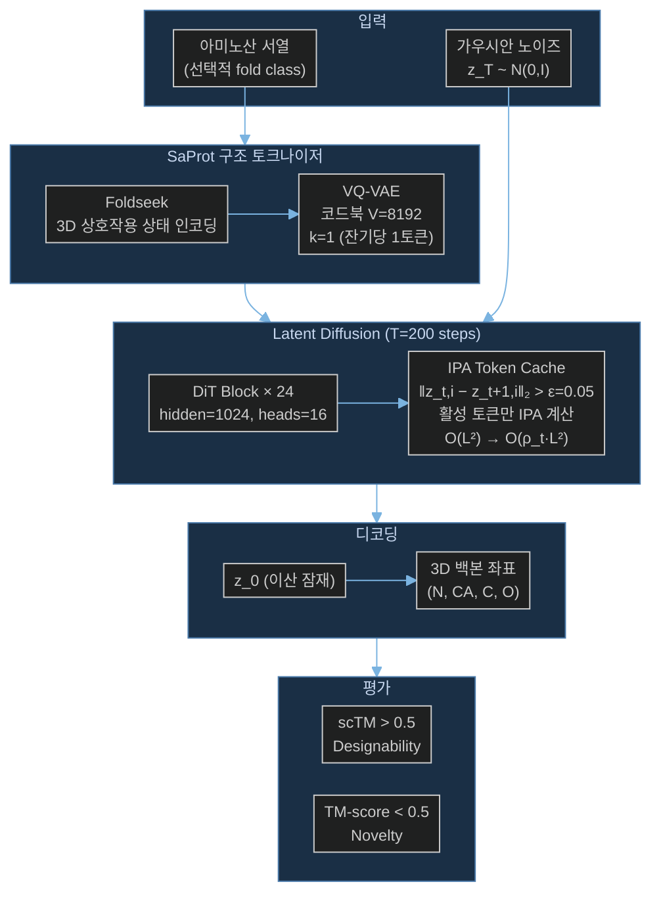

# Paper — SaDiT: Efficient Protein Backbone Design via Latent Structural Tokenization and Diffusion Transformers

## 메타

- **저자**: Shentong Mo, Lanqing Li
- **Venue / Year**: arXiv preprint, 2026
- **Link**: https://arxiv.org/abs/2602.06706
- **Code**: 미공개 (제출 시점 기준)
- **Tier**: ⭐ Must-cite
- **관련 프로젝트**: [[../../1_Projects/Crypticflow/README]]

## TL;DR (3줄)

1. SaProt 구조 토큰화 + Diffusion Transformer(DiT) + IPA Token Cache를 결합하여 단백질 백본 생성을 **230× 가속** (168초 → 0.73초/샘플).
2. 이산 잠재 공간(코드북 크기 8,192)으로 단백질 기하학을 표현하여 연속 좌표 diffusion의 복잡성을 제거.
3. 99.5% designability (무조건부), 800 residue에서도 75% designability — 장쇄 단백질에서 Proteína(54%)를 크게 능가.

## 핵심 아키텍처

## 문제 정의 (Problem)

기존 단백질 백본 생성 모델(RFDiffusion, Proteína 등)은:
- **연속 좌표 공간**에서 diffusion → 고차원, 계산 비용 ↑
- SE(3) equivariance 유지를 위한 IPA 반복 → 장쇄 단백질에서 O(L²) 메모리/시간 폭발
- RFDiffusion: 168초/샘플 → 실용적 스크리닝 불가

목표: 속도를 유지하면서 designability와 다양성을 모두 확보하는 실용적 단백질 설계 도구.

## 핵심 아이디어 (Method)

### 1. SaProt 이산 구조 토큰화
- **Foldseek** 기반 3D 상호작용 상태를 구조 어휘로 변환
- **VQ-VAE**로 코드북 크기 V=8,192 학습 (잔기당 1개 토큰, k=1)
- 연속 좌표 대신 이산 토큰 공간에서 diffusion → 생성 복잡도 대폭 감소

### 2. Diffusion Transformer (DiT) 백본
- 24개 DiT 블록, hidden dim=1,024, attention heads=16
- Timestep 조건화: adaLN-Zero 방식
- SE(3) equivariance를 IPA 레이어로 유지하면서 DiT 확장성 활용

### 3. IPA Token Cache (핵심 가속)
- 연속 diffusion step 간 잠재 벡터 변화량 측정: `‖z_{t,i} − z_{t+1,i}‖₂`
- 변화량 < ε=0.05이면 해당 토큰을 비활성화 → IPA 계산 건너뜀
- **복잡도**: O(L²) → O(ρ_t · L²), ρ_t = 활성 토큰 비율
- **효과**: 800 residue에서 피크 메모리 70% 감소, 마지막 30% 샘플링 단계에서 특히 효율적

## 실험 결과 (Results)

| 셋업 | 메트릭 | SaDiT | Proteína | RFDiffusion |
|------|--------|-------|----------|-------------|
| 무조건부 생성 | Designability (scTM>0.5) | **99.5%** | 98.1% | 86.0% |
| 무조건부 생성 | Diversity (클러스터 수) | **336** | 305 | — |
| 무조건부 생성 | TM-score | **0.89** | 0.83 | — |
| 800 residue | Designability | **75%** | 54% | — |
| 추론 속도 | 초/샘플 (A100) | **0.73** | 1.65 | 168 |
| 속도 비교 | RFDiffusion 대비 | **230×** | 102× | 1× |
| Fold 조건부 | Designability | 93.2% | — | — |

## 강점 / 약점

**Strengths**

- 230× 가속 — 실용적 고처리량 단백질 스크리닝 가능
- 이산 잠재 공간으로 SE(3) 등변성 유지하면서 DiT 확장성 획득
- IPA Token Cache: 긴 서열에서 메모리/시간 복잡도를 동적으로 감소
- 다양성(Diversity) 지표에서도 SOTA 달성

**Weaknesses**

- VQ-VAE 코드북이 학습 데이터 구조 어휘에 종속 → 새로운 폴드 토폴로지 일반화 불명확
- scRMSD=0.46Å로 Proteína(0.37Å)보다 낮음 → 정밀도 약간 열세
- 코드 미공개로 재현성 검증 제한
- apo→holo 같은 조건부 conformation 변화 작업에 대한 검증 없음

## 우리 연구와의 연결 고리

### 문제 3 (DiT 확장성 한계) — 직접 해법

- **DiT + IPA 결합의 최신 사례**: CrypticFlow가 DiT 기반으로 확장하려 할 때 SaDiT의 아키텍처(24 DiT 블록 + IPA 조합)가 직접 참조점
- **IPA Token Cache → 긴 단백질 처리 해법**: D3PM 데이터셋 max 3,611 residue 처리 시 O(L²) IPA 계산이 병목 — SaDiT의 캐시 메커니즘이 직접 적용 가능
- **이산 vs 연속 표현 비교**: CrypticFlow는 (L, 9) 연속 좌표 표현 사용
  - SaDiT 이산 표현: 속도↑, 코드북 범위 내 구조만 생성 가능
  - CrypticFlow 연속 표현: apo→holo 미세 좌표 변화를 직접 모델링 → conformation 변화 task에 더 적합
  - **결론**: SaDiT의 가속 기법(IPA 캐시)은 차용, 이산화는 CrypticFlow 목적에 부적합

### 문제 1 (Loss-RMSD 불일치) — 간접 관련

- SaDiT는 이산 공간 cross-entropy loss → NERF lever arm 문제 자체가 없음
- CrypticFlow의 연속 angle space loss와 대비하여 이산화가 loss 설계 문제를 우회하는 방법론적 대안임을 논의 가능

### 문제 2 (비연속 서열 처리) — 간접 관련

- SaDiT: 잔기당 1토큰(k=1) → chain break를 토큰 경계로 자연스럽게 처리할 여지 있음
- CrypticFlow의 chain break 미처리 문제 해결 방향으로 토큰 기반 표현 참조 가능

## 인용할 만한 문장

> "SaDiT achieves 230× speedup over RFDiffusion (168s → 0.73s per sample on a single A100 GPU) while maintaining 99.5% designability."

> "The IPA Token Cache reduces peak memory by 70% for 800-residue proteins by selectively reusing token states where ‖z_{t,i}−z_{t+1,i}‖₂ < ε."

## 추가로 읽을 참고문헌

- [ ] [[Paper_Bose23_FoldFlow]] — SE(3) flow matching, SaDiT의 IPA 기반
- [ ] [[Paper_Yim23_FrameDiff]] — IPA Transformer 원본 (SaDiT가 사용하는 IPA 출처)
- [ ] Foldseek 논문 — SaProt 토큰화의 기반 3D 상호작용 상태 인코딩
- [ ] Proteína 논문 — SaDiT의 주요 비교 대상 (1.65초/샘플, 54% @800res)
