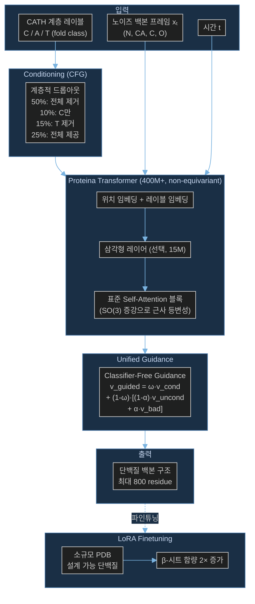

# Paper — Proteina: Scaling Flow-based Protein Structure Generative Models

## 메타

- **저자**: Tomas Geffner, Kieran Didi, Zuobai Zhang, Danny Reidenbach, Zhonglin Cao, Jason Yim, Mario Geiger, Christian Dallago, Emine Kucukbenli, Arash Vahdat, Karsten Kreis (NVIDIA GenAIR)
- **Venue / Year**: ICLR 2025 (Oral)
- **Link**: https://arxiv.org/abs/2503.00710
- **Code**: https://research.nvidia.com/labs/genair/proteina/ (프로젝트 페이지)
- **Tier**: Should-cite
- **관련 프로젝트**: [[../../README]]

## TL;DR (3줄)

1. SE(3) 등변성(equivariance) 없이도 400M+ 파라미터 non-equivariant transformer로 단백질 백본 생성 SOTA 달성 (ICLR 2025 Oral).
2. CATH 계층적 fold class label conditioning + classifier-free guidance + autoguidance 통합 제어 체계 구축.
3. AlphaFold DB에서 필터링한 **2,087만 개(21M)** 합성 구조로 학습 — 최대 800 residue, designability 99.0%.

## 핵심 아키텍처

## 문제 정의 (Problem)

- 기존 단백질 구조 생성 모델(RFDiffusion, FrameFlow, FrameDiff)은 모두 **SE(3) 등변 아키텍처** 사용 — 파라미터 확장이 어렵고 ~80M 수준에 머묾.
- 컴퓨터 비전·언어 모델에서는 비등변(non-equivariant) 대형 Transformer가 압도적 성능 달성 — 단백질 구조에도 적용 가능한지 미검증.
- 생성 다양성 제어 수단 부재 — fold class 수준의 고수준 조건부 생성이 없음.
- 훈련 데이터 병목: PDB ~150K 구조로는 대형 모델 학습 부족.

## 핵심 아이디어 (Method)

### 1. Non-Equivariant Scalable Transformer

| 모델 변형 | Transformer 파라미터 | 삼각형 레이어 |
|----------|---------------------|------------|
| ℳ_FS | 200M | O (15M) |
| ℳ_FS^no-tri | 200M | X |
| **ℳ_21M** | **400M** | O (15M) |

- 등변성 대신 **중심화(centering) + 무작위 SO(3) 회전 증강**으로 근사 등변성 학습.
- 표준 Self-Attention 기반 → 비전/언어 모델 스케일링 법칙 그대로 적용 가능.
- RFDiffusion 대비 **5배 이상** 큰 모델 (기존 단백질 구조 생성 모델 중 최대).

### 2. 계층적 Fold Class Conditioning (CATH)

CATH 분류 체계 C(Class) / A(Architecture) / T(Topology) 3레벨을 계층적 드롭아웃으로 조건화:

| 확률 | 조건 레이블 |
|------|-----------|
| 50% | {∅, ∅, ∅} — 비조건부 |
| 10% | {C, ∅, ∅} — Class만 |
| 15% | {C, A, ∅} — T 제거 |
| 25% | {C, A, T} — 전체 |

→ 조건부/비조건부 생성 동시 학습, 다양한 수준의 구조 제어 가능.

### 3. Unified Guidance (CFG + Autoguidance)

$$\mathbf{v}_{\text{guided}} = \omega \cdot \mathbf{v}_{\text{cond}} + (1-\omega)\left[(1-\alpha)\cdot\mathbf{v}_{\text{uncond}} + \alpha \cdot \mathbf{v}_{\text{bad}}\right]$$

- $\omega \geq 0$: 전체 가이던스 강도.
- $\alpha \in [0,1]$: CFG($\alpha=0$)와 autoguidance($\alpha=1$) 사이 보간.
- $\mathbf{v}_{\text{bad}}$: 품질 나쁜 모델(예: 소규모 모델)의 속도장 — 자동 가이던스 소스.
- 단백질 구조 생성에서 CFG·autoguidance 모두 **첫 번째 적용** 사례.

### 4. 대규모 합성 데이터셋 (𝒟_21M)

- **20,874,485개** 구조 (AFDB 필터링): 평균 pLDDT ≥ 85, pLDDT σ ≤ 15, coil 비율 ≤ 50%.
- 기존 작업 대비 **35배** 증가.
- 비교: 𝒟_FS = 588,318개 (Genie2 동일 데이터셋).

### 5. LoRA Finetuning

- ℳ_FS를 PDB의 소규모 설계 가능 단백질 데이터셋으로 LoRA 파인튜닝.
- 결과: designability **96.6%**, diversity **0.43**.
- β-시트 함량 약 **2배** 증가 — 단백질 구조 생성에서 LoRA 첫 시연.

## 실험 결과 (Results)

| 모델 | Designability | Diversity | Novelty (TM) | 최대 길이 |
|------|--------------|-----------|--------------|----------|
| **ℳ_21M (γ=0.3)** | **99.0%** | 0.30-0.71 | 0.35-0.39 | **800** |
| RFDiffusion | 96.9% | ~0.37 | ~0.74 | 300 |
| FrameFlow | 85% | 0.35 | 0.70 | 300 |
| Genie2 | ~90% | — | — | 512 |

- 장쇄(long-chain) 생성에서 "기존 모든 작업을 크게 능가".
- 단백질 분포 유사성 직접 측정하는 **신규 지표** 도입.

## 강점 / 약점

**Strengths**

- Non-equivariant + 대형 모델 조합이 등변 모델을 능가함을 실증 → 스케일링 가능성 증명.
- 21M 합성 데이터 → 대규모 사전학습 패러다임 확립.
- CFG + autoguidance 통합 제어 — fold 수준 조건부 생성.
- LoRA 파인튜닝으로 도메인 특화 적응 용이.
- ICLR 2025 Oral — 커뮤니티 인정도 높음.

**Weaknesses**

- 등변성 없음 → 회전 증강에 의존 — 이론적 보장 부재.
- 21M 합성 구조의 품질 신뢰도 (AFDB hallucination 위험).
- 서열 조건부 생성 없음 — FoldFlow-2와 달리 서열-구조 대응 학습 못함.
- 400M 모델 학습 비용 (CrypticFlow 직접 적용 어려움).
- fold class label이 없는 데이터(apo-holo 쌍)에 대한 conditioning 전략 불명확.

## 우리 연구와의 연결 고리

- **문제 3 (DiT 확장성 한계)**: CrypticFlow는 adaLN-Zero DiT, d=256, 6층으로 제한됨. Proteina는 non-equivariant 표준 Transformer가 400M까지 확장 가능함을 보임 → DiT 확장 방향의 핵심 근거. 등변성 없이도 충분한 성능을 낸다는 실증적 증거.
- **확장 전략 참조**: 중심화 + SO(3) 증강으로 근사 등변성을 학습하는 방식을 CrypticFlow 확장 시 채택 가능.
- **LoRA 파인튜닝**: apo-holo 쌍 데이터가 적은 CrypticFlow에 LoRA 파인튜닝 전략 직접 적용 가능.
- **CFG**: CrypticFlow에서 apo 구조 조건부 생성 강화에 CFG 도입 참조.
- [[Paper_Huguet24_FoldFlow2]] — 같은 문제를 서열 조건부 SE(3) 등변 방식으로 접근한 동시기 작업과 대비.

## 인용할 만한 문장

> "Proteina is the first large-scale successful non-equivariant flow model for unconditional protein structure generation."

> "Scaling the model and training data significantly improves performance, suggesting that protein structure generation can benefit from the scaling trends observed in other domains."

## 추가로 읽을 참고문헌

- [ ] [[Paper_Bose23_FoldFlow]] — SE(3) equivariant baseline 비교 대상
- [ ] [[Paper_Huguet24_FoldFlow2]] — 서열 조건부 SE(3) 등변 접근법 비교
- [ ] [[Paper_Wagner24_GAFL]] — geometric algebra attention으로 IPA 확장 (등변 대안)
