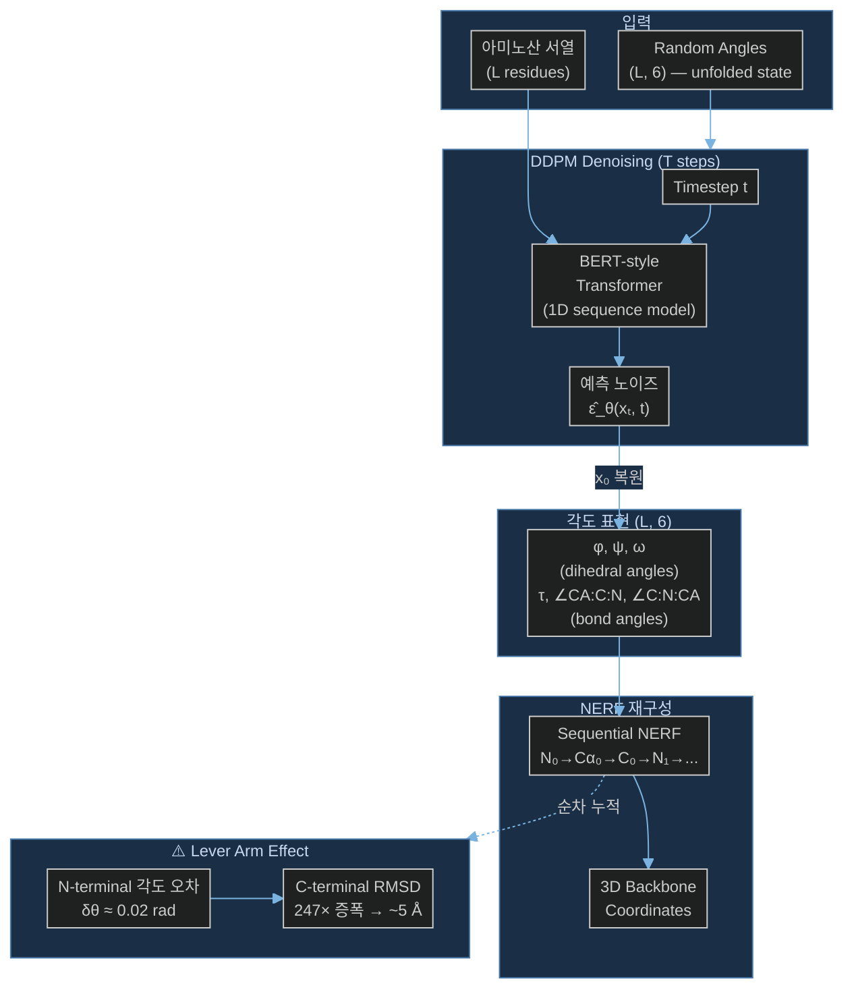

# Paper — FoldingDiff: Protein structure generation via folding diffusion

## 메타

- **저자**: Kevin E. Wu, Kevin K. Yang, Rianne van den Berg, Sarah Alamdari, James Y. Zou, Alex X. Lu, Ava P. Bhatt
- **Venue / Year**: Nature Communications, 2024
- **Link**: https://www.nature.com/articles/s41467-024-45051-2
- **Tier**: ⭐ Must-cite
- **원본 노트**: [[../../../../3_Resources/Papers/Paper_Wu24_FoldingDiff]]

## TL;DR (3줄)

1. Protein backbone을 6개 backbone angle per residue로 표현하고 DDPM으로 denoising하여 구조 생성.
2. Torsion angle 공간에서의 diffusion이 equivariant network 없이 shift/rotation invariance 달성.
3. **Lever arm effect 명시**: 단일 각도 오차가 체인 끝으로 갈수록 기하급수적으로 증폭. L≤70에서만 안정.

## 핵심 아키텍처

## 핵심 아이디어

- **표현**: `[φ, ψ, ω, τ, ∠CA:C:N, ∠C:N:CA]` × L residues → (L, 6) 각도 시퀀스
- **Diffusion**: DDPM on wrapped normal distribution (각도 공간)
- **Loss**: Radian-aware smooth L1 (wrapping 처리) ← CrypticFlow가 그대로 채택
- **Architecture**: BERT-style Transformer (1D, equivariant network 불필요)

## 우리 연구와의 연결 고리

- CrypticFlow가 동일한 torsion angle 표현 + NERF 사용 → 동일한 lever arm effect 발생
- Job 399: angle loss=0.0004 수렴 → RMSD=17.82 Å (891× 증폭) — 이 논문이 예측한 현상과 일치
- Radian-aware smooth L1 loss 인용 필요

## 인용할 만한 문장

> "this framing allows for single-angle errors to significantly alter the overall generated structure — a sort of lever arm effect"

## 추가로 읽을 참고문헌

- [ ] [[1_Projects/Crypticflow/Reading_Notes/Paper_Yim23_FrameDiff]] — lever arm effect 없는 SE(3) 접근
- [ ] [[1_Projects/Crypticflow/Reading_Notes/Paper_Int2Cart22]] — NERF 오차 누적 정량 분석
