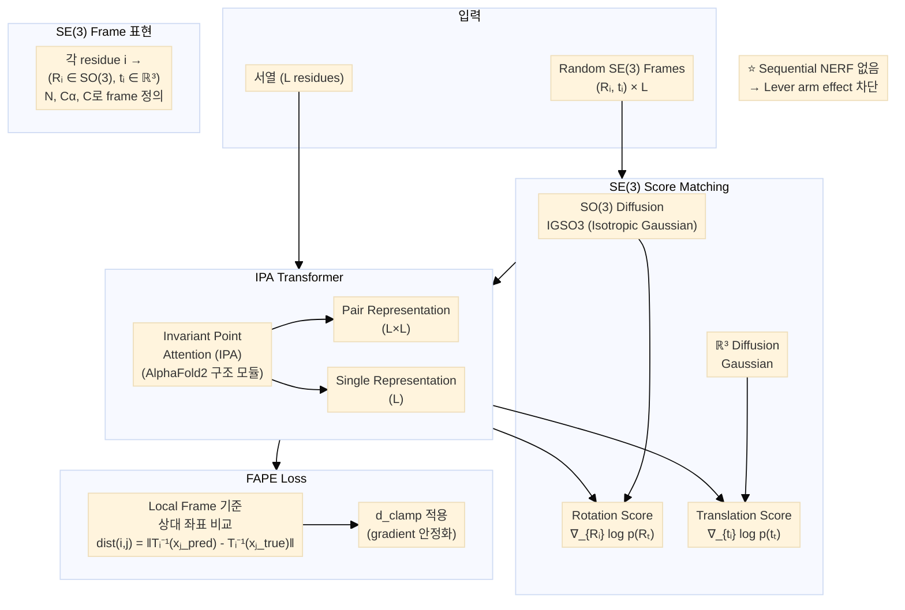

# Paper — FrameDiff: SE(3) diffusion model with application to protein backbone generation

## 메타

- **저자**: Jason Yim, Brian L. Trippe, Valentin De Bortoli, Emile Mathieu, Arnaud Doucet, Regina Barzilay, Tommi Jaakkola
- **Venue / Year**: ICML 2023
- **Link**: https://arxiv.org/abs/2302.02277
- **GitHub**: https://github.com/jasonkyuyim/se3_diffusion
- **Tier**: ⭐ Must-cite
- **원본 노트**: [[../../../../3_Resources/Papers/Paper_Yim23_FrameDiff]]

## TL;DR (3줄)

1. 각 residue를 SE(3) rigid frame으로 독립 표현하고 SE(3) 위에서 diffusion 수행.
2. Sequential chain reconstruction이 없으므로 **lever arm effect 구조적 차단**.
3. Pretrained structure prediction 없이 최대 500 residue까지 designable monomer 생성.

## 핵심 아키텍처

![[3_Resources/Papers/Paper_Yim23_FrameDiff_arch.png]]

Mermaid source

## 핵심 아이디어

- **표현**: `(Rᵢ, tᵢ) ∈ SE(3)` × L (각 residue 독립)
- **Diffusion**: SO(3) + ℝ³ 분리, IGSO3 noise schedule
- **Architecture**: IPA (Invariant Point Attention) Transformer — AlphaFold2 구조 모듈 차용
- **Loss**: FAPE (Frame Aligned Point Error)
- **핵심**: 체인 순서에 의존하지 않으므로 N-terminal 오차가 C-terminal로 전파되지 않음

## 우리 연구와의 연결 고리

- CrypticFlow의 장기 방향: torsion angle → SE(3) frame 전환 시 FrameDiff가 레퍼런스
- FAPE loss 수식 참조 (`losses.py`의 FAPE 구현이 이 논문 기반)
- CrypticFlow에서 FAPE + NERF backprop 조합이 폭발하는 이유: FrameDiff는 NERF 없이 바로 SE(3)에서 작동하기 때문

## 인용할 만한 문장

> "FrameDiff can generate designable monomers up to 500 amino acids without relying on a pretrained protein structure prediction network"

## 추가로 읽을 참고문헌

- [ ] [[1_Projects/Crypticflow/Reading_Notes/Paper_Bose23_FoldFlow]] — SE(3) flow matching 버전
- [ ] [[1_Projects/Crypticflow/Reading_Notes/Paper_Jumper21_AlphaFold2]] — IPA, FAPE loss 원조
