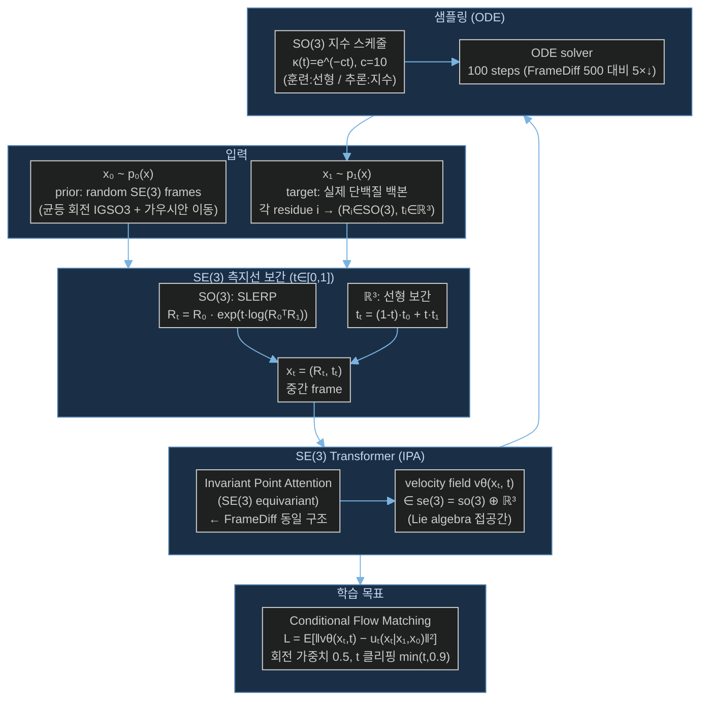

# Paper — FrameFlow: SE(3) Flow Matching을 이용한 빠른 단백질 백본 생성

## 메타

- **저자**: Jason Yim, Andrew Campbell, Emile Mathieu, Andrew Y. K. Foong, Michael Gastegger, José Jiménez-Luna, Sarah Lewis, Victor Garcia Satorras, Bastiaan S. Veeling, Frank Noé, Regina Barzilay, Tommi Jaakkola
- **소속**: MIT, Microsoft Research
- **Venue / Year**: ICLR 2024 Workshop (Generative and Experimental Perspectives for Biomolecular Design)
- **Link**: https://arxiv.org/abs/2310.05297
- **Code**: https://github.com/microsoft/protein-frame-flow
- **Tier**: ⭐ Must-cite
- **관련 프로젝트**: [[../../1_Projects/Crypticflow/README]]

## TL;DR (3줄)

1. FrameDiff(SE(3) diffusion)를 flow matching 패러다임으로 전환한 FrameFlow 제안 — NERF 없이 SE(3) frame 직접 예측.
2. SO(3) SLERP + ℝ³ 선형 보간의 측지선 기반 flow path로 더 직선적인 샘플링 궤적 달성.
3. FrameDiff 대비 5배 적은 샘플링 스텝(500→100)으로 설계성(designability) 83% 향상.

## 핵심 아키텍처

## 문제 정의 (Problem)

- 기존 단백질 백본 생성 모델(FrameDiff, GENIE)은 확산(diffusion) 기반 → 샘플링에 수백~수천 스텝 필요
- torsion angle 기반 표현(NERF 역기구학)은 **lever arm effect**: 앞쪽 결합각 오차가 뒤쪽 원자 위치에 증폭 → Loss-RMSD 불일치 야기
- SE(3) diffusion도 flow matching 대비 구불구불한 샘플링 경로 → 비효율적

## 핵심 아이디어 (Method)

### 1. SE(3) Frame 표현
- 각 residue i를 frame (Rᵢ ∈ SO(3), tᵢ ∈ ℝ³)으로 표현
- **NERF(Nerf/internal coordinate)를 전혀 사용하지 않음** → lever arm effect 구조적 차단
- 원자 위치는 frame으로부터 직접 복원 (AlphaFold2 방식)

### 2. SE(3) Flow Matching
- Prior p₀: IGSO3(σ=1.5) × 가우시안, Data p₁: PDB 단백질 구조
- 보간 경로:
  - SO(3): SLERP 측지선 `Rₜ = R₀ · exp(t·log(R₀ᵀR₁))`
  - ℝ³: 선형 보간 `tₜ = (1-t)t₀ + t·t₁`
- Velocity field vθ를 Lie algebra se(3) = so(3) ⊕ ℝ³에서 예측

### 3. IPA Transformer
- FrameDiff와 동일한 Invariant Point Attention 사용
- SE(3) equivariance 보장 — frame 회전/이동에 불변

### 4. FAPE Loss (보조)
- Frame Aligned Point Error: NERF backprop 없이 원자 좌표 오차를 직접 frame에서 계산
- AlphaFold2에서 가져온 구조 손실 — lever arm 없이 안정적 gradient

### 5. SO(3) 추론 스케줄 전환
- 훈련: 선형 스케줄 κ(t)=1-t
- 추론: 지수 스케줄 κ(t)=e^(−ct), c=10 → 회전이 이동보다 빠르게 수렴하도록 조정
- Kabsch 사전정렬로 ODE 운동 에너지 감소

## 실험 결과 (Results)

| 모델 | 샘플링 스텝 | Designability | 다양성 (클러스터) | 신규성 |
|------|------------|---------------|-------------------|--------|
| GENIE | 1000 | 0.22 | 0.76 (131개) | 0.54 |
| FrameDiff | 500 | 0.42 | 0.36 (104개) | 0.66 |
| **FrameFlow** | **100** | **0.77** | **0.28 (147개)** | **0.67** |

- 길이 100 residue 생성 속도: GENIE 128초 → FrameFlow **5.7초** (22×↑)
- FrameDiff 대비 designability **83% 향상**, 스텝 수 5× 감소

## 강점 / 약점

**Strengths**

- NERF 없는 SE(3) frame 표현으로 lever arm effect 구조적으로 제거
- Flow matching의 직선적 궤적 → 적은 NFE(Number of Function Evaluations)
- FAPE loss로 안정적 gradient, 훈련 수렴 향상
- 기존 FrameDiff 아키텍처 재활용 가능 → 구현 장벽 낮음

**Weaknesses**

- 단백질 백본(N, CA, C, O) 생성에 집중 — 사이드체인 미포함
- Unconditional generation 중심 — conditioning(서열, 기능) 확장 필요
- 단일 구조 생성 — 앙상블/다중 conformation 미지원
- apo→holo conformation change task에 직접 적용 불가 (생성 모델 프레임)

## 우리 연구와의 연결 고리

- **문제 1 해결 (Loss-RMSD 불일치 / NERF lever arm effect)**:
  - FrameFlow의 핵심 기여가 바로 이것 — torsion angle 기반 표현을 버리고 SE(3) frame으로 전환
  - CrypticFlow가 현재 torsion angle + NERF를 사용한다면 → SE(3) frame 방식으로 전환하는 직접적 레퍼런스
  - FAPE loss 채택 시 lever arm 없이 구조 오차를 안정적으로 최적화 가능

- **문제 2 (비연속 서열 / chain break 처리)**:
  - FrameFlow는 연속 서열 단백질 가정 — chain break 처리 미논의
  - SE(3) frame 표현 자체는 residue 단위로 독립적이므로 chain break에 유연하게 확장 가능
  - 실제 구현 시 chain break residue 쌍의 frame interpolation을 차단하는 마스킹 전략 필요

- **문제 3 (DiT 확장성 한계)**:
  - IPA Transformer는 O(N²) attention — 긴 서열에서 확장성 제한
  - FrameFlow도 동일한 구조적 한계 존재
  - 이 논문이 DiT 대안으로 직접 제시하진 않지만, SE(3) equivariant backbone 설계 시 참조

## 인용할 만한 문장

> "FrameFlow achieves 2× better designability than FrameDiff with 5× fewer sampling timesteps."

> "By using flow matching instead of diffusion, we enforce straighter sampling trajectories along geodesics where the distance varies linearly with time."

> "We use FAPE loss as an auxiliary supervision signal, which directly penalizes errors in atom positions without relying on NERF back-projection."

## 추가로 읽을 참고문헌

- [ ] [[Paper_Yim23_FrameDiff]] — SE(3) diffusion 전작 (FrameFlow의 베이스라인)
- [ ] [[Paper_Bose23_FoldFlow]] — 동시대 SE(3) flow matching (Riemannian OT 추가)
- [ ] [[Paper_Zhou25_DynamicFlow]] — apo→holo task로 SE(3) flow 적용 (직접 비교 baseline)
- [ ] [[Paper_Jumper21_AlphaFold2]] — IPA Transformer, FAPE loss 원출처
