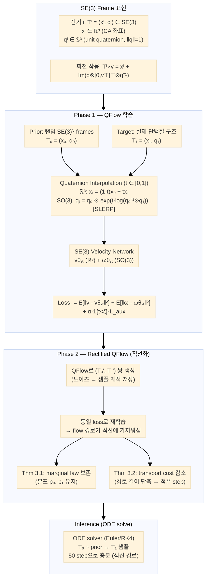

# Paper — ReQFlow: Rectified Quaternion Flow for Efficient and High-Quality Protein Backbone Generation

## 메타

- **저자**: Angxiao Yue, Zichong Wang, Hongteng Xu
- **Venue / Year**: ICML 2025
- **Link**: https://arxiv.org/abs/2502.14637
- **Code**: https://github.com/AngxiaoYue/ReQFlow
- **Tier**: ⭐ Must-cite
- **관련 프로젝트**: [[../../README]]

## TL;DR (3줄)

1. 단백질 백본의 SO(3) 회전을 **단위 사원수(unit quaternion)**로 표현하고 SLERP geodesic interpolation으로 flow matching → numerical stability 보장.
2. **QFlow → Rectified QFlow** 2단계 학습으로 flow 경로를 직선화 → inference step 수 대폭 감소 (50 step에서 RFDiffusion 대비 37×, Genie2 대비 63× 빠름).
3. 속도만 빠른 게 아니라 designability(0.972)·novelty(0.645) 모두 SOTA 달성.

## 핵심 아키텍처



## 문제 정의 (Problem)

기존 단백질 백본 생성 모델(RFDiffusion, Genie2, FrameDiff, FoldFlow)의 두 가지 핵심 문제:

1. **수치 불안정**: SO(3) 회전을 rotation matrix나 Euler angle로 표현하면 gimbal lock, numerical overflow 발생. 기존 SLERP 구현(FrameDiff, FoldFlow)도 exponential map 기반이라 극점(pole) 근처에서 불안정.
2. **느린 inference**: Diffusion 기반 모델은 수백~수천 step의 역방향 chain 필요. Flow matching 모델도 curved flow 경로 때문에 많은 step 요구.

**ReQFlow의 답**: unit quaternion으로 SO(3)를 parameterize(antipodal symmetry 처리 포함) + rectified flow로 경로 직선화.

## 핵심 아이디어 (Method)

### 1. Unit Quaternion으로 SO(3) 표현

사원수 정의: **q = s + xi + yj + zk ∈ ℍ**, 벡터 표현 **q = [s, u⊤]⊤ ∈ ℝ⁴**

단위 사원수 공간: **𝕊³ = {q ∈ ℝ⁴ | ‖q‖₂ = 1}**

- q와 -q가 같은 회전을 표현(antipodal 동치) → 학습 시 canonical form으로 통일
- 9개 파라미터(rotation matrix) → 4개(quaternion) → 제약 조건 1개 → 자유도 3 (SO(3)과 일치)
- **장점**: matrix exponential 없이 곱셈·켤레만으로 회전 합성 → gradient 계산 안정

### 2. Quaternion SLERP (지수 형태)

시간 t에서의 보간:
```
qₜ = q₀ ⊗ exp(t · log(q₀⁻¹ ⊗ q₁))
```
각속도: **ω = φu** (상수, φ = 회전각, u = 회전축)

- 기존 SLERP: `sin((1-t)θ)/sinθ · q₀ + sin(tθ)/sinθ · q₁` → θ≈0일 때 수치 불안정
- ReQFlow의 지수 형태: log/exp 연산이 항상 안정적, θ=0 극한도 L'Hôpital로 처리 가능

### 3. QFlow: Quaternion Flow Matching

각 잔기 i의 frame: **Tⁱ = (xⁱ, qⁱ) ∈ SE(3)**

**Translation (ℝ³)**:
- 보간: xₜ = (1-t)x₀ + tx₁
- 목표 속도: v = x₁ - x₀
- 예측: vθ,ₜ = (xθ,₁ - xₜ)/(1-t)

**Rotation (SO(3), quaternion)**:
- 보간: qₜ = q₀ ⊗ exp(t · log(q₀⁻¹ ⊗ q₁))
- 목표 각속도: ω = 2·log(qₜ⁻¹ ⊗ q₁)/(1-t) (상수)
- 예측: ωθ,ₜ = 2·log(qₜ⁻¹ ⊗ qθ,₁)/(1-t)

**Loss 함수**:
```
L_R³  = E_{t,T₀,T₁}[ ‖v - vθ,ₜ‖² ]
L_SO(3) = E_{t,Q₀,Q₁}[ ‖ω - ωθ,ₜ‖² ]
L_total = L_R³ + L_SO(3) + α·1{t<ζ}·L_aux
```
- L_aux: 초기 구간(t < ζ) 안정화를 위한 auxiliary loss

### 4. Rectified QFlow: 2단계 학습으로 경로 직선화

**Phase 1**: QFlow로 (노이즈 T₀, 생성 샘플 T₁) 쌍 대량 생성

**Phase 2**: 생성된 쌍 {T₀', T₁'}로 동일 loss 함수로 재학습 (warm start: Phase 1 체크포인트에서 초기화)

**이론적 보장 (논문 Theorem 3.1, 3.2)**:
- **Thm 3.1**: Rectified flow는 원본 marginal distribution p₀, p₁을 보존
- **Thm 3.2**: Rectification 후 flow 경로의 transport cost(곡률)가 감소 → 더 적은 ODE step으로 동일 품질

**효과**: 50 step으로 500 step QFlow보다 빠르고 비슷하거나 더 좋은 품질.

## 실험 결과 (Results)

### PDB 데이터셋 비교 (길이 300 기준)

| 모델 | Designability (↑) | scRMSD (↓) | Diversity (↑) | Novelty (↑) | 추론 시간 |
|------|:-----------------:|:----------:|:-------------:|:-----------:|:--------:|
| RFDiffusion | 0.904 | 1.102±1.617 | 0.382 | 0.527 | 644.66s |
| Genie2 | 0.908 | 1.132±1.389 | 0.370 | 0.475 | 1127.30s |
| FrameDiff | 0.581 | — | — | — | — |
| FoldFlow-SFM | 0.710 | — | — | — | — |
| QFlow (500 step) | 0.968 | 1.084±0.501 | 0.378 | 0.638 | 17.42s |
| **ReQFlow (50 step)** | **0.972** | **1.071±0.482** | 0.377 | **0.645** | **1.78s** |

- RFDiffusion 대비 **37×**, Genie2 대비 **63×** 빠름 (50 step 기준)
- Designability와 Novelty 모두 SOTA

### SCOPe 데이터셋 (fold conditioned generation)
- 조건부 생성에서도 동일한 경향: ReQFlow가 속도·품질 모두 우위

## 강점 / 약점

**Strengths**

- Quaternion SLERP의 지수 형태로 수치 안정성 이론적 보장 (기존 SLERP 대비)
- Rectified flow의 이론적 보장(Thm 3.1, 3.2)이 명확 — 단순 경험적 주장 아님
- 2단계 학습이라 기존 flow matching 모델에 plug-in으로 적용 가능 (범용성)
- 속도 개선이 극적 (37~63×) 이면서도 품질 저하 없음

**Weaknesses**

- **조건부 생성** (서열 기반, motif scaffolding 등) 실험이 제한적 — 백본 unconditional 생성에 집중
- Rectification 2단계 학습이 추가 compute를 요구 (단, inference에서 회수)
- unit quaternion의 antipodal 동치(q ↔ -q) 처리가 구현 복잡도를 높임
- 서열 설계(ProteinMPNN)와의 파이프라인 통합은 별도 단계로 분리됨 (end-to-end 아님)

## 우리 연구와의 연결 고리

### 문제 1: Loss-RMSD 불일치 (NERF lever arm, angle space loss)

- **직접 연결**: CrypticFlow가 현재 torsion angle 공간(NERF 방식)에서 rotation을 표현 → NERF lever arm 문제 발생 (angle 오차가 CA 좌표 오차로 증폭)
- **ReQFlow 방향**: SO(3) frame 표현으로 전환할 때 rotation을 **unit quaternion**으로 parameterize → loss가 rotation 공간에서 직접 정의됨, NERF lever arm 없음
- **구체적 적용**: `L_SO(3) = E[‖ω - ωθ,ₜ‖²]` 형태의 quaternion angular velocity loss → CrypticFlow의 angle space loss 대체 후보
- **FAPE vs. quaternion loss**: SE(3) 전환 후 rotation loss를 quaternion으로 정의하면 FAPE보다 수치 안정적 (FAPE는 frame 간 거리 계산에 matrix inversion 포함)
- 기존 [[Paper_Bose23_FoldFlow]]·[[Paper_Yim23_FrameDiff]]가 SLERP를 쓰지만 ReQFlow가 **지수 형태 SLERP**로 numerical stability를 명시적으로 개선했다는 점에서 차별화

### 문제 2: 비연속 서열 처리

- ReQFlow 자체는 이 문제를 직접 다루지 않음 (연속 백본 생성)
- 그러나 **SE(3)ᴺ 위의 frame 표현**은 residue 간 연결 정보 없이 각 잔기를 독립적 frame으로 처리 → 비연속 서열(chain break)도 자연스럽게 처리 가능한 구조
- CrypticFlow에서 비연속 서열을 처리할 때 SE(3) frame 방식 채택 시 ReQFlow의 구현이 직접 참조 가능

### 문제 3: DiT 확장성 한계

- ReQFlow의 velocity network 구조가 SE(3) equivariant transformer 기반 → CrypticFlow의 DiT를 SE(3)-equivariant 구조로 교체할 때 참조
- **Rectified flow의 ODE step 감소**: CrypticFlow의 현재 Euler ODE solver가 많은 step을 요구하는 문제 → ReQFlow의 rectification 2단계 학습을 적용하면 inference step 수를 50 이하로 줄일 수 있음
- 50 step × 빠른 forward pass = DiT 대비 확장성 문제를 inference 단에서 완화 가능

## 관련 논문과 비교

| 논문 | SO(3) 표현 | Interpolation | Inference 속도 |
|------|:----------:|:-------------:|:--------------:|
| [[Paper_Yim23_FrameDiff]] | Rotation matrix + exp map | SLERP (삼각함수) | ~2000 step |
| [[Paper_Bose23_FoldFlow]] | SE(3) frames | SLERP (삼각함수) | ~100 step |
| **ReQFlow (이 논문)** | **Unit quaternion** | **SLERP (지수 형태, 안정)** | **50 step** |

## 인용할 만한 문장

> "ReQFlow achieves on-par or better performance than existing methods while being 37× faster than RFDiffusion and 63× faster than Genie2 on generating protein backbones with 300 residues."

> "The key insight is that unit quaternions provide a numerically stable parameterization of SO(3), and the exponential form of SLERP avoids the singularities inherent in the trigonometric form."

> "Rectification reduces the transport cost of the flow, allowing accurate ODE integration with fewer function evaluations."

## 추가로 읽을 참고문헌

- [ ] [[Paper_Yim23_FrameDiff]] — SE(3) diffusion, ReQFlow의 비교 대상
- [ ] [[Paper_Bose23_FoldFlow]] — SE(3) flow matching, SLERP 방식 비교
- [ ] Liu et al. (2022) "Flow Straight and Fast: Learning to Generate and Transfer Data with Rectified Flow" — Rectified flow 원논문
- [ ] RFDiffusion (Watson et al. 2023) — 주요 비교 대상 (37× 느림)
- [ ] Genie2 (Lin & AlQuraishi 2023) — 주요 비교 대상 (63× 느림)
