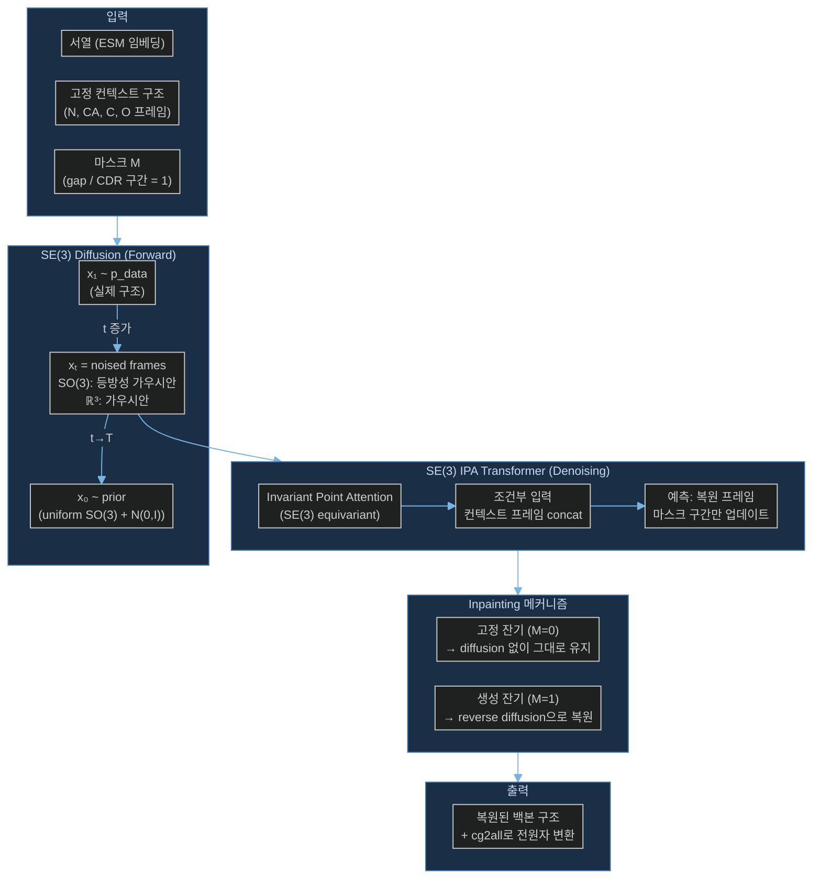

# Paper — FrameDiPT: SE(3) Diffusion Model for Protein Structure Inpainting

## 메타

- **저자**: Cheng Zhang, Adam Leach, Thomas Makkink, Miguel Arbesu, Ibtissem Kadri, Daniel Luo, et al. (InstaDeep Ltd & BioNTech)
- **Venue / Year**: bioRxiv 2023
- **Link**: https://www.biorxiv.org/content/10.1101/2023.11.21.568057v2
- **Code**: https://github.com/instadeepai/FrameDiPT
- **Tier**: ⭐ Must-cite
- **관련 프로젝트**: [[../../1_Projects/Crypticflow/README]]

## TL;DR (3줄)

1. SE(3) 확산 모델을 단백질 구조 **인페인팅(inpainting)** 에 적용 — 마스킹된 구간을 주변 구조+서열 조건으로 복원.
2. TCR CDR 루프처럼 변가변 영역(hypervariable region)을 마스크 토큰으로 처리, 나머지 고정 구조에 조건화해 생성.
3. ProteinGenerator · RFdiffusion 대비 유사한 설계 가능성(scRMSD)을 보이면서 구조 분포 다양성과 참신성을 확보.

## 핵심 아키텍처

## 문제 정의 (Problem)

기존 SE(3) 확산 기반 단백질 **생성** 모델(FrameDiff 등)은 전체 단백질을 처음부터 새로 생성하는 데 초점을 맞췄다. 그러나 실제 드러그 디자인에서는 단백질의 **일부 구간만 재설계** 해야 하는 경우가 많다 (예: 항체 CDR 루프, T세포 수용체 결합 루프). 이 논문은 나머지 구조를 고정한 채 마스킹된 구간만 조건부 생성하는 **구조 인페인팅** 문제를 다룬다.

**핵심 질문**: 주변 구조 컨텍스트와 서열 정보를 조건으로 주어졌을 때, 비어 있는(또는 chain gap이 있는) 구간의 3D 구조를 어떻게 확률적으로 복원할 것인가?

## 핵심 아이디어 (Method)

### 1. SE(3) 프레임 표현
- 각 잔기 i를 SE(3) 강체 프레임 (Rᵢ ∈ SO(3), tᵢ ∈ ℝ³)으로 표현 — [[Paper_Yim23_FrameDiff]] 방식 상속
- 회전: SO(3) 위 등방성 가우시안 노이즈
- 병진: ℝ³ 가우시안 노이즈

### 2. 이진 마스크 M으로 inpainting 구현
- **M[i] = 0** (고정 잔기): forward diffusion 없이 컨텍스트로만 사용
- **M[i] = 1** (생성 잔기): 완전한 forward → reverse diffusion 수행
- Reverse sampling 시 마스킹된 잔기만 업데이트, 고정 잔기 좌표는 변경 불가
- → **chain gap = mask token** 으로 자연스럽게 처리 가능

### 3. 조건부 생성 (Conditioned Generation)
- 서열 조건: ESM 기반 임베딩 주입
- 구조 조건: 고정 잔기의 SE(3) 프레임을 IPA에 직접 concat
- 마스킹 구간 양쪽 flanking region을 anchor로 사용 → N/C 말단 방향 제약

### 4. 아키텍처 구현
- 기반 모델: OpenFold의 IPA Transformer 포크
- 서열 설계: ProteinMPNN 포크로 후처리
- 전원자 변환: cg2all (백본 → 사이드체인)
- GPU 1장으로 추론 가능 (ESMFold 필요)

## 실험 결과 (Results)

| 셋업 | 메트릭 | 값 |
|-----|--------|-----|
| TCR CDR 루프 설계 | scRMSD (자체 일관성 RMSD) | RFdiffusion과 유사 |
| 설계 가능성 (designability) | 낮은 scRMSD 비율 | ProteinGenerator 대비 경쟁력 |
| 구조 다양성 | 클러스터 수 / 샘플 수 | 기존 대비 향상 |
| 참신성 | Foldseek TM-score vs PDB | 새로운 구조 공간 탐색 |

- CDR 루프처럼 **hypervariable** 한 구간에서 결정론적 방법 대비 구조 분포를 더 잘 포착
- 바인딩 상태(apo/holo)별 구조 분포 차이를 구분 가능

## 강점 / 약점

**Strengths**

- Chain gap을 **마스크 토큰**으로 추상화 → gap 있는 단백질에 직접 적용 가능
- 기존 FrameDiff 코드베이스 재활용 → 구현 진입 장벽 낮음
- 서열+구조 이중 조건화 → 더 정확한 inpainting
- 확률적 출력 → 단일 구조가 아닌 분포로 생성

**Weaknesses**

- TCR CDR 특화 → 일반 단백질 루프나 domain gap에 대한 검증 부족
- 전체 de novo 생성은 지원하지 않음 (inpainting 전용)
- 고정 구조와 생성 구간 경계의 연속성 처리 방식 명확하지 않음
- 대규모 chain break (긴 missing loop) 처리 성능 미검증

## 우리 연구와의 연결 고리

### 문제 2 직접 해법: D3PM 비연속 단백질 chain gap 처리

CrypticFlow의 핵심 난제는 apo↔holo 쌍 데이터에서 **chain gap**(missing residue)을 가진 비연속 단백질을 어떻게 처리하느냐다. FrameDiPT는 이에 대한 가장 직접적인 선례를 제공한다:

1. **마스크 토큰 전략**: chain gap 구간에 M=1 마스크를 적용 → CrypticFlow의 `feature_mask`를 chain break mask로 확장하는 방향과 일치
2. **구현 방법**: `feature_mask[gap_start:gap_end] = 1.0` 형태로 gap 구간을 생성 대상으로 지정, 나머지 고정 구조를 컨텍스트로 조건화
3. **Flanking anchor**: gap 양쪽의 고정 잔기 프레임이 자연스러운 boundary 제약을 제공 → NERF lever arm 문제 완화에도 기여

### 문제 1 연결: Loss-RMSD 불일치

- Inpainting mask 경계에서 각도 공간 loss와 실제 RMSD 사이의 불일치가 증폭될 수 있음
- FrameDiPT의 scRMSD 평가 방식이 CrypticFlow angle space loss 재설계 방향에 참고 가능

### 문제 3 연결: DiT 확장성

- IPA Transformer 기반 → DiT로 교체 시 inpainting mask를 condition token으로 처리하는 방식 참고 가능

**결론**: CrypticFlow D3PM 데이터셋의 chain gap 처리에 FrameDiPT의 이진 마스크 + flanking anchor 전략을 직접 이식할 수 있다.

## 인용할 만한 문장

> "FrameDiPT is a generalised protein inpainting model conditioned on sequence and surrounding structural context, using SE(3) rigid body frame diffusion where rotations are diffused with isotropic Gaussians on SO(3) and translations with Gaussians on ℝ³."

> "Masked sections are recovered via reverse diffusion conditioned on fixed flanking regions, enabling targeted redesign of hypervariable loops without perturbing the rest of the structure."

## 추가로 읽을 참고문헌

- [ ] [[Paper_Yim23_FrameDiff]] — SE(3) diffusion 기반 모델 (FrameDiPT의 직접 전신)
- [ ] [[Paper_Watson23_RFdiffusion]] — chain break /0 token 처리 비교
- [ ] [[Paper_Ingraham23_Chroma]] — 비연속 crop 학습 전략 비교
- [ ] [[Paper_Bose23_FoldFlow]] — SE(3) flow matching (diffusion 대안)
