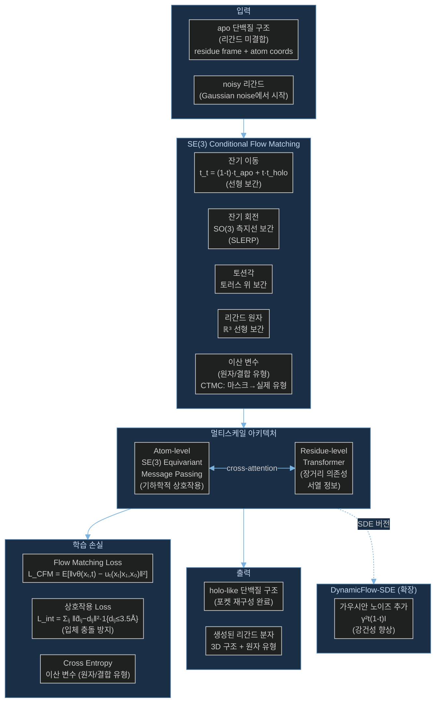

# Paper — DynamicFlow: 단백질 동역학을 고려한 구조 기반 약물 설계

## 메타

- **저자**: Xiangxin Zhou, Xiwei Cheng, Yuning Shen, Yu Bao, Liang Wang, Quanquan Gu
- **Venue / Year**: ICLR 2025
- **Link**: https://arxiv.org/abs/2503.03989
- **Code**: 미공개 (논문 기준)
- **Tier**: ⭐ Must-cite
- **관련 프로젝트**: [[../../1_Projects/Crypticflow/README]]

## TL;DR (3줄)

1. 단백질 apo(미결합)→holo(결합) 구조 변화를 명시적으로 모델링하는 SE(3)-equivariant flow matching 기반 약물 설계 모델.
2. atom-level SE(3) message passing + residue-level Transformer의 멀티스케일 아키텍처로 full-atom 정확도 달성.
3. DynamicFlow-ODE(결정적)와 DynamicFlow-SDE(확률적) 두 버전 제공 — 기존 경직 단백질 SBDD 대비 Vina Score 및 포켓 재구성 성능 향상.

## 핵심 아키텍처



## 문제 정의 (Problem)

- 기존 SBDD(Structure-Based Drug Design) 모델은 단백질을 **경직 구조(rigid)** 로 취급
- 실제 단백질은 리간드 결합 시 **유도 적합(induced fit)** 현상 발생 → apo와 holo 구조가 상이
- 예시: Abl 키나제의 DFG-in(활성) vs DFG-out(비활성) 상태에서 서로 다른 억제제 결합 패턴
- apo 구조에서 직접 설계된 리간드는 실제 결합 시 포켓 변화로 인해 sub-optimal 결합 친화도

## 핵심 아이디어 (Method)

### 1. 데이터 구성 (MD 기반 apo/holo pair)
- 분자동역학(MD) 시뮬레이션으로 동일 단백질의 apo/holo 구조 쌍 구축
- apo 상태(t=0)에서 holo 상태(t=1)로의 flow 정의
- apo-holo pair가 flow matching의 자연스러운 (x₀, x₁) 데이터 결합 역할

### 2. 연속 변수 Flow (SE(3) Equivariant)
- **잔기 이동**: 선형 보간 `tₜ = (1-t)·t_apo + t·t_holo`
- **잔기 회전**: SO(3) 측지선(SLERP) 보간 `Rₜ = R_apo · exp(t·log(R_apoᵀ R_holo))`
- **토션각**: 토러스(Torus) 위의 보간 (주기적 대칭 고려)
- **리간드 원자**: ℝ³ 선형 보간

### 3. 이산 변수 Flow (CTMC)
- 원자 유형, 결합 유형: 마스크 토큰에서 실제 유형으로 연속 시간 마르코프 연쇄(CTMC) 전환
- 크로스 엔트로피 손실로 학습

### 4. 멀티스케일 아키텍처
- **(a) Atom-level SE(3)-equivariant message passing**: 모든 원자의 기하학적 상호작용 캡처 (단거리 구조 정확도)
- **(b) Residue-level Transformer**: 서열 정보 + 장거리 의존성 (전반적 구조 일관성)
- 두 레벨 간 cross-attention으로 정보 교환

### 5. 상호작용 Loss
```
L_int = Σᵢⱼ ‖d̂ᵢⱼ − dᵢⱼ‖² · 1{dᵢⱼ ≤ 3.5Å}
```
- 근접 원자 쌍(≤3.5Å)의 거리를 직접 회귀 → 입체 충돌(steric clash) 방지

### 6. DynamicFlow-ODE vs SDE
- **ODE**: 결정적 경로, 재현 가능
- **SDE**: `γ²t(1-t)I` 가우시안 노이즈 추가 → 다양성 및 강건성 향상

## 실험 결과 (Results)

| 모델 | Vina Score (↓) | RMSD (포켓) | 원자 유형 정확도 |
|------|----------------|-------------|-----------------|
| 경직 단백질 SBDD | 높음 (suboptimal) | 크게 어긋남 | 보통 |
| DynamicFlow-ODE | 개선 | 낮음 | 높음 |
| DynamicFlow-SDE | **최우수** | **최저** | **최고** |

- 키나제 DFG 구조 변화 (DFG-in↔out) 같은 의약학적으로 중요한 conformation 포착 성공
- 생성된 holo-like 구조를 기존 SBDD 도구 입력으로 활용 시 추가 성능 향상 (상승효과)
- 포켓 부피 변화(수축/확대) 정확히 재현

## 강점 / 약점

**Strengths**

- apo→holo conformation change를 명시적으로 모델링하는 첫 주요 시도
- Full-atom (리간드 포함) SE(3)-equivariant flow — 구조 정확도 높음
- MD 기반 데이터셋으로 생물물리학적 타당성 확보
- 기존 SBDD 파이프라인과 직접 연동 가능 (holo 구조 사전 생성 후 전달)

**Weaknesses**

- **포켓(binding pocket) 중심** — CrypticFlow의 전체 backbone 변화와 범위 상이
- MD 시뮬레이션 기반 데이터 구축 비용 높음
- 리간드 공동 생성 모델 — 리간드 없는 apo→holo 순수 backbone flow와 다른 설정
- 코드 미공개 (재현 어려움)

## 우리 연구와의 연결 고리

- **문제 1 해결 (Loss-RMSD 불일치 / NERF lever arm effect)**:
  - DynamicFlow도 SE(3) frame + 측지선 보간 사용 → torsion angle NERF 없음
  - Full-atom SE(3) flow가 lever arm effect를 구조적으로 차단하는 방식의 추가 레퍼런스
  - 잔기 이동·회전 + 토션각 보간의 조합이 CrypticFlow 설계에 직접 참조 가능

- **문제 2 (비연속 서열 / chain break 처리)**:
  - DynamicFlow는 연속 residue 가정으로 보임 — chain break 처리 방법 미상세 기술
  - 그러나 MD 시뮬레이션 기반 데이터는 실제 multi-chain 단백질 포함 가능
  - **가장 직접적인 비교 baseline**: CrypticFlow(전체 backbone) vs DynamicFlow(포켓 중심) 비교 실험 필요

- **문제 3 (DiT 확장성 한계)**:
  - Atom-level message passing + Residue-level Transformer 멀티스케일 구조
  - 긴 단백질에서 atom-level의 확장성이 DiT 대비 어떤지 논문에서 명시 불명확
  - 포켓 한정 모델이므로 전체 backbone 규모에서의 확장성은 별도 검증 필요

- **데이터셋 구축 방법론 참조**:
  - MD 기반 apo/holo pair 데이터셋 구축 → CrypticFlow 학습 데이터 파이프라인에 적용 가능
  - 동일 단백질의 다중 MD 스냅샷에서 apo/holo pair 선별 전략

## 인용할 만한 문장

> "Existing SBDD methods treat protein pockets as rigid structures, overlooking the crucial role of protein dynamics in ligand binding."

> "DynamicFlow models the apo-to-holo conformational change jointly with ligand generation, enabling more realistic and effective drug candidate discovery."

> "The apo-holo state pairs naturally serve as the (x₀, x₁) data coupling in conditional flow matching."

## 추가로 읽을 참고문헌

- [ ] [[Paper_Yim23_FrameFlow]] — SE(3) flow matching 백본 생성 (방법론 기반)
- [ ] [[Paper_Bose23_FoldFlow]] — SE(3) flow matching 원형
- [ ] [[Paper_Sesame25_ApoHolo]] — 동일 apo→holo task 비교 대상
- [ ] [[Paper_Meller23_PocketMiner]] — cryptic pocket 탐지 (관련 task)
