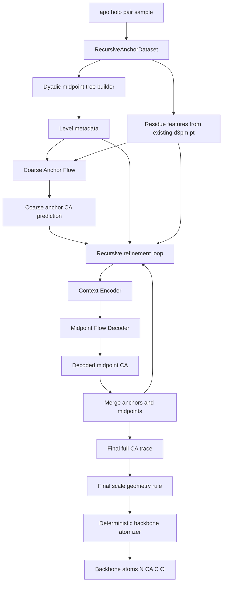
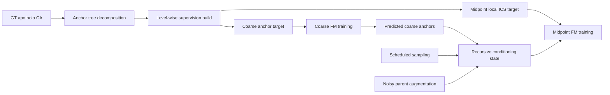
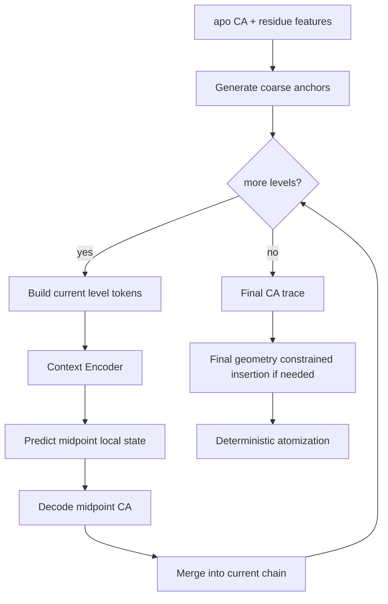
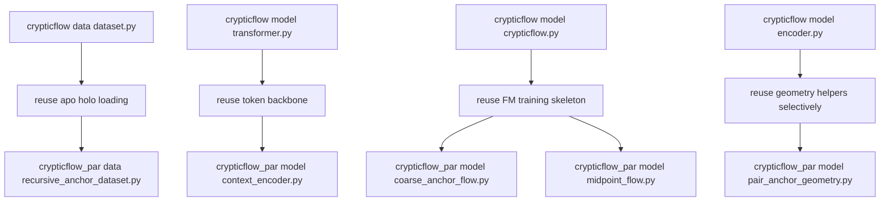

# Recursive Anchor-ICS for `crypticflow_PAR`

## 한 줄 요약

이 문서는 [recursive_anchor_ics.md](/home/mjkim/project/crypticflow_par/docs/recursive_anchor_ics.md)를 실제 `crypticflow_PAR` 코드로 옮기기 위한 **상세 구현 계획서**다.  
권장 MVP는:

1. **coarse anchor는 Cartesian CA flow**
2. **midpoint는 pair-anchored local ICS flow**
3. **마지막은 `omega-only` 또는 deterministic final insertion**
4. **full backbone은 deterministic atomization**

의 4단 구조로 시작하는 것이다.

---

## 1. 목표와 범위

### 목표

- apo -> holo backbone generation에서 lever arm effect를 줄인다.
- one-shot 전체 Cartesian/ICS generation 대신, recursive coarse-to-fine generation으로 문제를 분해한다.
- 기존 `crypticflow`의 데이터와 FM 학습 루프를 최대한 재사용한다.
- 첫 구현에서는 feature engineering보다 **factorization과 geometry representation**의 효과를 먼저 검증한다.

### 비목표

- 첫 버전에서 sidechain까지 직접 생성하지 않는다.
- 첫 버전에서 pair-biased attention, register token, 복잡한 pair update를 넣지 않는다.
- 첫 버전에서 coarse scale을 ICS로 만들지 않는다.

---

## 2. 권장 시스템 요약

### 핵심 설계

- **Global branch**
  sparse anchor CA chain을 Cartesian FM으로 생성
- **Local branch**
  각 anchor interval의 midpoint를 local ICS state로 생성
- **Context branch**
  이전 scale까지의 구조 상태를 transformer가 `z_cond`로 요약
- **Geometry branch**
  마지막 scale과 backbone 복원은 가능한 한 deterministic하게 처리

### 왜 이 구조가 좋은가

- coarse global motion은 Cartesian이 단순하고 안정적이다.
- local interval은 ICS가 physical validity를 더 잘 반영한다.
- recursive refinement는 긴 NERF/ICS chain에서 생기는 error accumulation을 작은 local subproblem으로 쪼갠다.
- 마지막 scale을 geometry-heavy하게 설계하면 학습해야 할 자유도가 크게 줄어든다.

---

## 3. 전체 아키텍처

### 3.1 시스템 개요



### 3.2 학습 시 데이터 흐름



### 3.3 추론 시 recursive 생성 루프



---

## 4. 코드 구조 제안

### 4.1 신규 디렉토리 구조

```text
crypticflow_par/
├── configs/
│   ├── recursive_anchor_mvp.yaml
│   ├── midpoint_only_overfit.yaml
│   ├── coarse_anchor_only.yaml
│   └── recursive_anchor_full.yaml
├── data/
│   ├── anchor_tree.py
│   ├── recursive_anchor_dataset.py
│   └── collate.py
├── model/
│   ├── pair_anchor_geometry.py
│   ├── context_encoder.py
│   ├── coarse_anchor_flow.py
│   ├── midpoint_flow.py
│   ├── recursive_anchor_par.py
│   ├── backbone_atomizer.py
│   └── losses.py
├── train_midpoint_only.py
├── train_coarse_anchor.py
├── train_recursive_anchor.py
├── eval_recursive_anchor.py
└── tests/
    ├── test_anchor_tree.py
    ├── test_pair_anchor_geometry.py
    ├── test_recursive_dataset.py
    └── test_roundtrip.py
```

### 4.2 기존 `crypticflow`에서 재사용할 부분



### 4.3 파일별 책임

#### `data/anchor_tree.py`

역할:

- residue length `L`에 대해 ragged dyadic midpoint tree 생성
- level별 anchor set과 midpoint interval metadata 생성
- split rule `m = floor((l + r)/2)` 구현
- chain break / missing residue segment 분리 지원

핵심 함수:

- `build_anchor_tree(length, segments=None)`
- `build_level_metadata(tree)`
- `flatten_level_tokens(tree)`

#### `data/recursive_anchor_dataset.py`

역할:

- 기존 d3pm `.pt` 파일 로드
- apo/holo CA 좌표, scalar feature, ESM embedding 로드
- anchor tree 생성
- coarse anchor target과 midpoint local target 구성
- level별 token feature gather

핵심 함수:

- `__getitem__(idx)`
- `_build_level_targets(sample)`
- `_gather_residue_features(indices)`

#### `model/pair_anchor_geometry.py`

역할:

- local ICS encode/decode
- robust frame builder
- feasibility penalty
- optional projection
- final-scale `omega-only` decoder

핵심 함수:

- `encode_midpoint_state(A, M, B, apo_ref=None)`
- `decode_midpoint_state(A, B, state, apo_ref=None)`
- `build_local_frame(A, B, apo_mid=None, prev_frame=None)`
- `feasibility_loss(rL, rR, d)`
- `decode_final_scale_omega_only(A, B, omega_head)`

#### `model/context_encoder.py`

역할:

- 이전 scale까지의 token을 받아 현재 scale용 `z_cond` 생성
- scale-block causal mask 적용
- residue 위치 + scale id + interval metadata embedding

핵심 클래스:

- `RecursiveContextEncoder`

#### `model/coarse_anchor_flow.py`

역할:

- sparse anchor Cartesian CA를 apo -> holo로 이동시키는 FM 모델
- coarse branch에서만 zero-center 옵션 지원

핵심 클래스:

- `CoarseAnchorFlowModel`

#### `model/midpoint_flow.py`

역할:

- pair-anchored midpoint local state FM
- state target은 기본적으로 `(u_L, u_R, sin omega, cos omega)`
- optional Cartesian self-conditioning 지원

핵심 클래스:

- `MidpointFlowModel`

#### `model/recursive_anchor_par.py`

역할:

- coarse branch와 midpoint branch orchestration
- level loop
- scheduled sampling
- noisy parent augmentation
- optional force-decode mode

핵심 클래스:

- `RecursiveAnchorPAR`

#### `model/backbone_atomizer.py`

역할:

- final CA trace로부터 backbone atom 복원
- deterministic N, CA, C, O placement
- geometry quality evaluation helper 제공

핵심 함수:

- `atomize_backbone_from_ca(ca_trace)`

---

## 5. 데이터 계약

### 5.1 샘플 입력 구조

첫 구현에서는 기존 d3pm benchmark와 최대한 동일한 입력을 유지한다.

필수 입력:

- `apo_ca`: `(L, 3)`
- `holo_ca`: `(L, 3)`
- `mask`: `(L,)`
- `feat_scalar`: `(L, d_feat)`
- `esm_embedding`: `(L, d_esm)` 또는 저장 포맷에 맞는 equivalent
- `residue_index`: `(L,)`

### 5.2 level별 supervision 구조

```python
sample = {
    "apo_ca": Tensor[L, 3],
    "holo_ca": Tensor[L, 3],
    "mask": BoolTensor[L],
    "feat_scalar": Tensor[L, d_feat],
    "esm_embedding": Tensor[L, d_esm],
    "levels": [
        {
            "level_id": int,
            "anchor_idx": LongTensor[n_anchor],
            "mid_idx": LongTensor[n_mid],
            "left_parent_idx": LongTensor[n_mid],
            "right_parent_idx": LongTensor[n_mid],
            "span": LongTensor[n_mid],
            "n_left": LongTensor[n_mid],
            "n_right": LongTensor[n_mid],
            "is_leaf": BoolTensor[n_mid],
            "is_final_leaf": BoolTensor[n_mid],
            "apo_anchor_ca": Tensor[n_anchor, 3],
            "holo_anchor_ca": Tensor[n_anchor, 3],
            "apo_mid_state": Tensor[n_mid, 4],
            "holo_mid_state": Tensor[n_mid, 4],
            "feat_mid": Tensor[n_mid, d_feat],
            "esm_mid": Tensor[n_mid, d_esm],
        }
    ]
}
```

### 5.3 collate 시 배치 전략

초기 구현은 단순성을 위해:

- 한 배치에서 비슷한 길이끼리 묶기
- level별 token 수가 비슷한 샘플끼리 묶기
- midpoint-only overfit 단계에서는 `batch_size=1` 또는 아주 작게 시작

를 권장한다.

padding 대상:

- residue-level feature
- level별 anchor token
- level별 midpoint token

mask 대상:

- valid residue mask
- valid anchor token mask
- valid midpoint token mask
- scale-block attention mask

---

## 6. 표현과 상태공간

### 6.1 coarse anchor state

기본 표현:

- `X_anchor = CA coordinates in Cartesian`

shape:

- `(n_anchor, 3)`

첫 구현에서는 direct target을 권장한다.

### 6.2 midpoint local state

기본 표현:

- `u_L`
- `u_R`
- `sin omega`
- `cos omega`

decode:

- `r_L = 3.8 * n_L * sigmoid(u_L)`
- `r_R = 3.8 * n_R * sigmoid(u_R)`
- `omega = atan2(sin omega, cos omega)`

대안:

- final scale에서는 `omega-only`
- full learned local Cartesian residual은 후순위 ablation

### 6.3 final deterministic geometry stage

최종 권장 순서:

1. recursive refinement로 full CA trace 생성
2. 마지막 scale의 leaf interval은 `omega-only` 또는 deterministic rule 실험
3. backbone atomizer로 `N, CA, C, O` 복원

---

## 7. 모델 아키텍처 상세

### 7.1 context encoder

입력 token 구성:

- current known anchor/midpoint Cartesian
- residue position embedding
- scale id embedding
- interval metadata embedding
- residue scalar feature
- residue ESM feature

출력:

- `z_cond` for current level tokens

권장 baseline:

- plain transformer encoder
- scale-block causal mask
- pair bias 없음
- register token 없음

### 7.2 coarse anchor flow

입력:

- apo coarse anchor CA
- anchor residue feature
- `z_cond` optional
- FM time `t`

출력:

- clean anchor CA 또는 velocity parameterization

처음 구현 권장:

- direct Cartesian target
- simple FM ODE-style sampling
- optional self-conditioning only later

### 7.3 midpoint flow

입력:

- left parent anchor CA
- right parent anchor CA
- apo local state
- midpoint residue feature
- midpoint ESM feature
- `z_cond`
- FM time `t`
- optional decoded midpoint self-conditioning

출력:

- `(u_L, u_R, sin omega, cos omega)`

loss:

- local state loss
- feasibility loss
- optional decoded midpoint coordinate loss

### 7.4 recursive orchestration

각 level에서 하는 일:

1. 현재까지의 anchor/midpoint chain 정리
2. current level token 생성
3. context encoder로 `z_cond` 계산
4. midpoint flow 또는 coarse flow 실행
5. decode된 midpoint를 현재 chain에 merge
6. 다음 level로 진행

---

## 8. 학습 전략

### 8.1 Stage 0: geometry-only round trip

목표:

- 표현 문제가 없는지 확인

실험:

1. holo GT -> anchor tree decomposition
2. midpoint local state encode
3. decode back
4. original CA와 비교

성공 기준:

- midpoint round-trip error가 거의 0
- frame flip / infeasible decode가 안정적으로 처리됨

### 8.2 Stage 1: midpoint-only overfit

조건:

- GT parent anchor 사용
- midpoint local state만 학습

확인할 것:

- local state가 학습 가능한가
- `omega`가 안정적으로 들어오는가
- feasibility violation이 줄어드는가

### 8.3 Stage 2: recursive teacher-forced refinement

조건:

- coarse anchor는 GT holo
- 각 level midpoint는 예측
- 다음 level condition에는 이전 예측을 사용

목표:

- parent error 없이 recursion 자체가 안정한지 확인

### 8.4 Stage 3: coarse anchor flow 추가

조건:

- sparse anchor apo -> holo FM
- 이후 midpoint recursive refinement 연결

목표:

- 전역 오차와 지역 오차를 함께 보기 시작

### 8.5 Stage 4: deterministic backbone atomization

목표:

- CA 품질과 backbone 품질 분리
- geometry validity를 평가 지표로 추가

### 8.6 Stage 5: PAR-style context와 scheduled sampling

조건:

- no-AR baseline 완료 후 적용

추천 순서:

1. simple concat context
2. transformer context encoder
3. scale-block causal mask
4. scheduled sampling
5. noisy parent augmentation

---

## 9. Loss 설계

### 9.1 coarse anchor loss

```text
L_coarse = FM_loss(X_anchor_pred, X_anchor_gt)
```

optional:

- translation-invariant RMSD auxiliary
- anchor pair distance auxiliary

### 9.2 midpoint local state loss

```text
L_mid =
    w_u * MSE(u_L_pred, u_L_gt)
  + w_u * MSE(u_R_pred, u_R_gt)
  + w_w * MSE(sin omega_pred, sin omega_gt)
  + w_w * MSE(cos omega_pred, cos omega_gt)
```

### 9.3 feasibility loss

```text
L_feas =
    relu(d - (r_L + r_R))^2
  + relu(abs(r_L - r_R) - d)^2
```

### 9.4 decoded coordinate auxiliary

```text
L_coord = Huber(M_decoded, M_gt)
```

### 9.5 backbone auxiliary

최종 단계 또는 평가용:

```text
L_backbone_aux = RMSD(backbone_atomized, backbone_gt)
```

### 9.6 추천 초기 조합

```text
L_total =
    lambda_coarse * L_coarse
  + lambda_mid * L_mid
  + lambda_feas * L_feas
  + lambda_coord * L_coord
  + lambda_skip2 * L_skip2
```

첫 버전에서는 `L_backbone_aux`는 평가용으로만 두는 것이 안전하다.

---

## 10. 추론 알고리즘

### 10.1 기본 추론 루프

1. apo 구조에서 coarse anchor 추출
2. coarse anchor FM으로 holo coarse anchor 생성
3. 현재 level token 구성
4. context encoder로 `z_cond` 생성
5. midpoint flow로 local state 생성
6. decode하여 midpoint CA 생성
7. current chain에 merge
8. 마지막 level까지 반복
9. final CA trace를 backbone atomizer에 통과

### 10.2 force-decode 진단 모드

모드:

- `GT coarse + pred last 1 level`
- `GT coarse + pred last 2 levels`
- `pred coarse + GT midpoint`
- `pred coarse + pred midpoint`

이 모드의 목적:

- coarse branch가 병목인지
- midpoint branch가 병목인지
- recursion error propagation이 병목인지

를 분리하는 것이다.

### 10.3 sampling policy

권장 baseline:

- coarse anchor flow: stochastic early, deterministic late
- midpoint flow: first version은 deterministic ODE-style만으로 시작

---

## 11. 설정 파일 초안

### 11.1 `configs/recursive_anchor_mvp.yaml`

포함할 항목:

- dataset path
- feature mode
- max length
- tree split rule
- coarse anchor stride or top-level sparsity
- midpoint state definition
- final-scale mode
- FM solver config
- scheduled sampling probability
- noisy parent augmentation scale

예시 스키마:

```yaml
model:
  coarse_mode: cartesian
  midpoint_state: [uL, uR, sinw, cosw]
  final_scale_mode: omega_only
  use_context_encoder: false
  use_self_conditioning: false

tree:
  split_rule: floor_midpoint
  keep_first_last_anchor: true

training:
  stage: midpoint_only
  scheduled_sampling_prob: 0.0
  noisy_parent_sigma: 0.0
  diffusion_batch_mul: 2

loss:
  lambda_mid: 1.0
  lambda_feas: 0.5
  lambda_coord: 0.5
  lambda_skip2: 0.2
```

---

## 12. 테스트 계획

### 12.1 단위 테스트

#### `test_anchor_tree.py`

- `L=8, 9, 17, 100, 219`에서 tree 생성
- 모든 residue가 정확히 한 번 midpoint로 등장하는지 확인
- parent-child interval 일관성 확인

#### `test_pair_anchor_geometry.py`

- encode -> decode round trip
- `rho^2 < 0` fallback
- `apo midpoint`가 축 위에 가까운 경우 fallback axis 동작
- `omega` sign consistency

#### `test_recursive_dataset.py`

- feature 길이와 residue 길이 정합성
- level별 tensor shape 검증
- `mid_idx`와 parent index mapping 검증

#### `test_roundtrip.py`

- holo GT 전체를 decomposition 후 reconstruction
- final CA RMSD와 per-level RMSD 계산

### 12.2 통합 테스트

1. midpoint-only overfit 1 sample
2. midpoint-only overfit small batch
3. coarse-anchor-only overfit
4. recursive teacher-forced overfit
5. full recursive overfit

---

## 13. 실험 로드맵

### 실험 1

- geometry-only round trip
- 목표: 표현 버그 제거

### 실험 2

- midpoint-only overfit
- 목표: local ICS 학습 가능성 검증

### 실험 3

- GT coarse + predicted midpoint
- 목표: recursion stability 확인

### 실험 4

- coarse-anchor-only FM
- 목표: sparse Cartesian anchor branch 품질 측정

### 실험 5

- full recursive without AR context
- 목표: no-AR baseline 확보

### 실험 6

- simple concat context
- 목표: context가 정말 필요한지 확인

### 실험 7

- PAR-style context encoder
- 목표: scale-block causal context의 이득 측정

### 실험 8

- scheduled sampling
- 목표: train-test mismatch 감소 확인

### 실험 9

- final-scale deterministic vs omega-only vs full learned
- 목표: local geometry hard constraint의 효과 비교

---

## 14. 리스크와 대응

### 리스크 1. local frame flip

대응:

- robust `e2/e3` builder
- fallback axis
- previous-level sign alignment

### 리스크 2. infeasible sphere intersection

대응:

- `L_feas`
- decode-time projection
- fallback center placement

### 리스크 3. coarse anchor가 너무 성기거나 너무 조밀함

대응:

- top-level sparsity를 ablation
- `L=1..100` 구간에서 실제 tree depth 통계 확인

### 리스크 4. recursion error propagation

대응:

- scheduled sampling
- noisy parent augmentation
- force-decode 진단

### 리스크 5. deterministic final decoder가 너무 보수적임

대응:

- `omega_apo`
- `omega-only`
- full learned final step

3종 비교

---

## 15. 첫 스프린트에서 바로 할 일

### Sprint 1

1. `anchor_tree.py` 작성
2. `pair_anchor_geometry.py` 작성
3. geometry round-trip 테스트 작성
4. `recursive_anchor_dataset.py` 초안 작성
5. 샘플 1개에 대해 level metadata dump하는 디버그 스크립트 작성

### Sprint 1 완료 기준

- `L=219` 같은 길이에서도 tree 생성이 안정적일 것
- holo GT encode -> decode round trip이 거의 lossless할 것
- midpoint target tensor가 학습 입력으로 바로 들어갈 형태로 정리될 것

### Sprint 2

1. midpoint-only model 작성
2. overfit config 작성
3. local loss/feasibility loss 붙이기
4. 단일 샘플 overfit

### Sprint 2 완료 기준

- midpoint-only에서 거의 0에 가까운 overfit 가능
- `omega`와 decoded CA가 같이 수렴

---

## 16. 구현 우선순위 최종 권장안

정말 중요한 순서는 아래다.

1. **표현이 lossless한지 검증**
2. **midpoint local ICS가 학습 가능한지 검증**
3. **recursive loop가 parent error 없이 안정한지 검증**
4. **coarse anchor generation 추가**
5. **마지막에 context encoder와 scheduled sampling 추가**

즉 첫 구현에서 제일 먼저 풀 문제는
"좋은 transformer를 설계하는 것"이 아니라,

> **recursive anchor factorization과 pair-anchored local ICS 표현이 실제로 작동하는가**

를 증명하는 것이다.

이 문서 기준 MVP가 통과되면,
그 다음부터는 PAR-style context, self-conditioning, noisy parent augmentation 같은 기법을 차례대로 얹으면서 성능을 밀어올리는 전략이 가장 안전하다.
