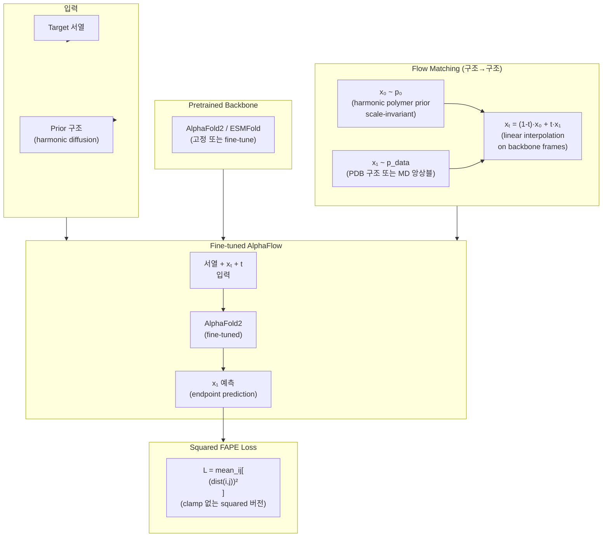

# Paper — AlphaFlow: AlphaFold Meets Flow Matching for Generating Protein Ensembles

## 메타

- **저자**: Matthew Jude Bose et al.
- **Venue / Year**: arXiv:2402.04845, 2024
- **Link**: https://arxiv.org/abs/2402.04845
- **Tier**: Should-cite
- **원본 노트**: [[../../../../3_Resources/Papers/Paper_Bose24_AlphaFlow]]

## TL;DR (3줄)

1. AlphaFold/ESMFold를 flow matching 프레임워크로 fine-tune하여 단백질 구조 **앙상블** 생성.
2. Squared FAPE loss를 사용한 새로운 훈련 전략으로 all-atom 예측 가능.
3. PDB 훈련 시 AlphaFold+MSA subsampling보다 precision-diversity tradeoff에서 우월.

## 핵심 아키텍처

## 핵심 아이디어

- **Pretrained backbone 재활용**: AlphaFold2를 처음부터 학습하지 않고 flow matching으로 fine-tune
- **Harmonic prior**: 폴리머 구조 특성을 반영한 scale-invariant noising
- **Squared FAPE**: 표준 FAPE(clamp 있음)보다 부드러운 gradient → all-atom 예측에서 안정적
- **목적**: 단일 구조가 아닌 conformational ensemble 생성

## 우리 연구와의 연결 고리

- CrypticFlow와 목표 다름: AlphaFlow는 ensemble 샘플링, CrypticFlow는 apo→holo 특정 전환
- Squared FAPE가 standard FAPE(clamp 포함)보다 안정적이라는 점 → CrypticFlow에서 FAPE 재시도 시 참조
- Pretrained ESMFold 기반 ESMFlow 버전이 CrypticFlow의 ESM-3 conditioning과 유사한 방향

## 인용할 만한 문장

> "a novel training strategy using a squared Frame Aligned Point Error (FAPE) loss, tailored to ensure that AlphaFlow and ESMFlow output meaningful all-atom predictions"

## 추가로 읽을 참고문헌

- [ ] [[Paper_Sesame25_ApoHolo]] — apo→holo 직접 예측 (더 관련성 높음)
- [ ] [[Paper_Jumper21_AlphaFold2]] — FAPE 원조
