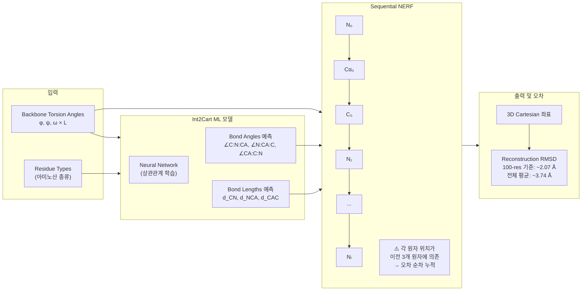

# Paper — Int2Cart: Learning Correlations between Internal Coordinates to improve 3D Cartesian Coordinates for Proteins

## 메타

- **저자**: (arXiv 원문 확인 필요)
- **Venue / Year**: Journal of Chemical Theory and Computation (JCTC), 2022
- **Link**: https://arxiv.org/abs/2205.04676 | https://pubs.acs.org/doi/10.1021/acs.jctc.2c01270
- **Tier**: Should-cite
- **원본 노트**: [[../../../../3_Resources/Papers/Paper_Int2Cart22]]

## TL;DR (3줄)

1. Backbone torsion angle → 3D Cartesian 변환 시 발생하는 NERF 오차 누적을 정량 분석.
2. Bond length/angle들 사이의 상관관계를 ML로 학습하면 재구성 정확도 향상.
3. 100-residue 기준 RMSD ~2.07 Å — lever arm effect의 정량적 근거 제공.

## 핵심 아키텍처

## 핵심 아이디어

- **관찰**: Bond length/angle은 torsion angle 및 residue type과 상관관계가 있음
- **방법**: ML로 이 상관관계를 학습 → 고정값 사용 대비 재구성 정확도 향상
- **한계**: NERF sequential reconstruction 자체의 오차 누적 문제는 해결하지 못함

## 우리 연구와의 연결 고리

- CrypticFlow Exp5에서 ε=0.02 rad → RMSD 4.95 Å (247× 증폭) 실험적 확인
- Int2Cart의 정량 분석(100-res RMSD ~2.07 Å)이 CrypticFlow lever arm effect 수치 인용의 이론적 배경
- CrypticFlow는 bond length/angle을 학습하지 않고 고정값 사용 → Int2Cart 방식 적용 시 개선 가능하나 근본 해결은 SE(3) 전환

## 인용할 만한 문장

> "adopting a sequential reconstruction method such as NeRF accumulates small errors that result in inadequate ring closure"

## 추가로 읽을 참고문헌

- [ ] MP-NeRF (PubMed 2022) — NERF 병렬화
- [ ] [[Paper_Wu24_FoldingDiff]] — lever arm effect 명시
