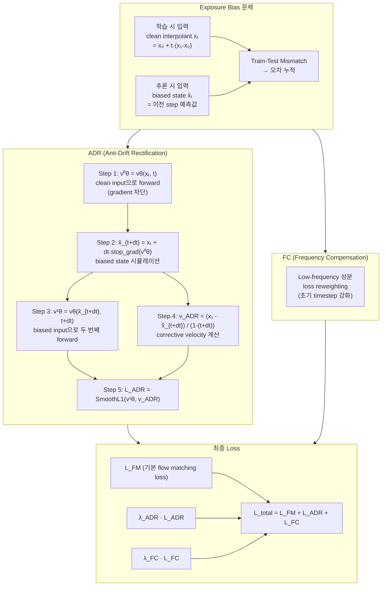

# Paper — ReflexFlow: Rethinking Learning Objective for Exposure Bias Alleviation in Flow Matching

## 메타

- **저자**: (arXiv 원문 확인 필요)
- **Venue / Year**: arXiv:2512.04904, 2025
- **Link**: https://arxiv.org/abs/2512.04904
- **Tier**: Should-cite
- **원본 노트**: [[../../../../3_Resources/Papers/Paper_ReflexFlow25_ADR]]

## TL;DR (3줄)

1. Flow Matching의 train-test mismatch(exposure bias)의 두 가지 근본 원인 규명.
2. **ADR (Anti-Drift Rectification)**: biased state를 시뮬레이션하고 corrective velocity를 추가 학습.
3. **FC (Frequency Compensation)**: 초기 denoising에서 놓치는 저주파 성분을 loss reweighting으로 보상.

## 핵심 아키텍처

## 핵심 아이디어

- **Exposure bias 원인 1**: 모델이 biased input에 대한 일반화 능력 부재 → ADR로 해결
- **Exposure bias 원인 2**: 초기 denoising에서 저주파 성분 부족 → FC로 해결
- **핵심**: training 중에 추론 조건(biased state)을 시뮬레이션하여 학습

## 우리 연구와의 연결 고리

- CrypticFlow에 ADR을 직접 구현하여 실험함 (`crypticflow.py:373-436`)
- 결과: Xt mode에서 val_loss 0.000771 (개선)이나 RMSD 4.81 Å (약간 악화)
- **핵심 발견**: X0 mode (apo 고정 입력)가 exposure bias를 원천 차단 → ADR보다 효과적
  - X0 mode RMSD: **2.38 Å** vs ADR RMSD: 4.81 Å
- ADR은 Xt input mode에서만 의미 있음

## 인용할 만한 문장

> "ReflexFlow: reflexive refinement of the Flow Matching learning objective that dynamically corrects exposure bias"

## 추가로 읽을 참고문헌

- [ ] Riemannian Flow Matching (Chen & Lipman, 2024)
