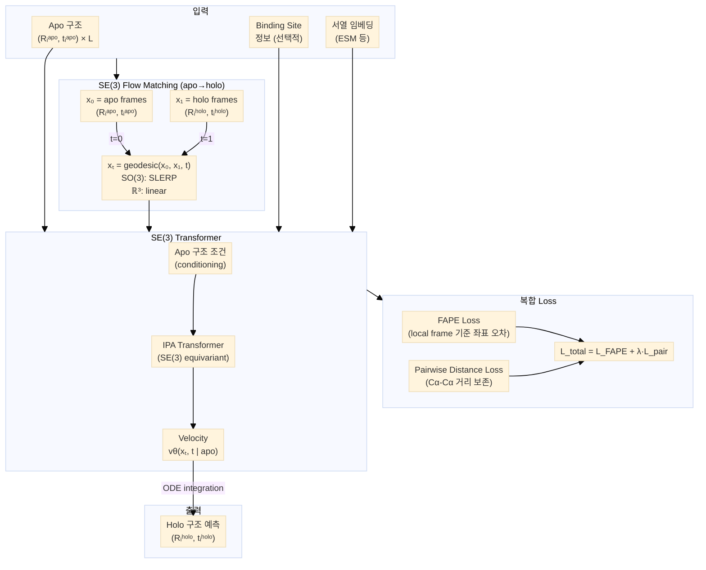

# Paper — Sesame: Opening the door to protein pockets

## 메타

- **저자**: (arXiv 원문 확인 필요)
- **Venue / Year**: GEM Workshop @ ICLR 2025 / arXiv:2509.05302
- **Link**: https://arxiv.org/abs/2509.05302
- **Tier**: ⭐ Must-cite (CrypticFlow와 동일 task)
- **원본 노트**: [[../../../../3_Resources/Papers/Paper_Sesame25_ApoHolo]]

## TL;DR (3줄)

1. **CrypticFlow와 동일한 task**: Apo → Holo conformation change를 flow matching으로 생성.
2. SE(3) frame + FAPE + pairwise distance loss 조합으로 lever arm effect 없이 학습.
3. MD simulation 대비 훨씬 빠른 속도로 virtual screening에 적합한 pocket geometry 생성.

## 핵심 아키텍처

![[Paper_Sesame25_ApoHolo_arch.png]]

📐 Mermaid source — 수정 후 <code>scripts/render_mermaids.sh</code> 재실행

## 핵심 아이디어

- **표현**: SE(3) frames (NERF 없음 → lever arm effect 없음)
- **Conditioning**: Apo 구조를 flow의 시작점(x₀)으로 사용 (CrypticFlow X0 mode와 유사)
- **Loss**: FAPE + pairwise Cα distance loss 조합 → 3D 구조 일관성 보장
- **목적**: Ligand binding pocket의 geometry를 holo-like로 변환 → docking 성능 향상

## 우리 연구와의 연결 고리

- **가장 중요한 비교 대상**: CrypticFlow와 동일한 apo→holo task
- CrypticFlow와 차별점:
  - Sesame: SE(3) frames, pocket 중심, docking 목적
  - CrypticFlow: torsion angle (→SE(3) 전환 예정), 전체 backbone, 일반적 conformation change
- 논문 작성 시 Related Work에서 Sesame를 직접 비교해야 함
- Sesame의 FAPE + pairwise distance loss 조합이 CrypticFlow에서 발산한 FAPE만 단독 사용 대비 안정적인 이유 참조

## 인용할 만한 문장

> "Sesame: a generative model designed to predict conformational change efficiently by generating geometries better suited for ligand accommodation"

## 추가로 읽을 참고문헌

- [ ] [[Paper_Bose23_FoldFlow]] — 동일 SE(3) flow matching 방법론
- [ ] [[Paper_Jumper21_AlphaFold2]] — FAPE loss
