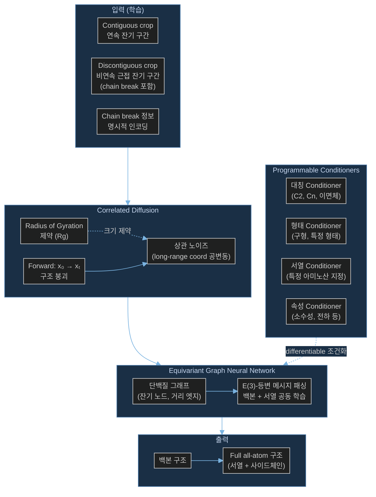

# Paper — Chroma: Illuminating Protein Space with a Programmable Generative Model

## 메타

- **저자**: John Ingraham, Max Barber, Jenna Derry, David Edelman, Benjamin Fitzsimmons, et al. (Generate:Biomedicines)
- **Venue / Year**: Nature 2023
- **Link**: https://www.nature.com/articles/s41586-023-06728-8
- **Code**: https://github.com/generatebio/chroma
- **Tier**: Should-cite
- **관련 프로젝트**: [[../../1_Projects/Crypticflow/README]]

## TL;DR (3줄)

1. 확산 모델 + 등변 그래프 신경망 + 조건부 랜덤장(CRF)을 결합해 all-atom 단백질 구조를 **프로그래밍 방식**으로 설계하는 생성 모델.
2. 잔기 수에 대해 **준이차(sub-quadratic)** 복잡도 — 상업용 GPU에서 수분 내 대규모 복합체 생성 가능.
3. Conditioner 모듈을 조합해 대칭, 형태, 서열 제약 등을 differentiable하게 적용하는 **programmable design** 프레임워크.

## 핵심 아키텍처



## 문제 정의 (Problem)

단백질 설계에서 기존 방법들은:
1. 구조와 서열을 **분리**해 순차적으로 설계 → 공동 최적화 어려움
2. 대칭, 형태, 기능 등 **복잡한 제약**을 동시에 적용하기 어려움
3. 비연속 잔기(chain break 있는 단백질)를 연속 단백질로 **강제 변환** 후 학습 → gap 정보 손실

Chroma는 이를 통합 생성 모델 + 모듈형 Conditioner로 해결한다.

## 핵심 아이디어 (Method)

### 1. 비연속 Crop 학습 전략 (핵심 — 문제 2 관련)

Chroma의 학습 데이터 전처리에서 두 가지 crop 방식을 모두 사용:

- **Contiguous crop**: 단백질에서 연속된 잔기 구간 추출 (기존 방식)
- **Discontiguous proximal crop**: 3D 공간에서 **가깝지만 서열상 불연속**인 잔기들을 함께 추출
  - 예: 두 루프가 공간적으로 근접하지만 중간에 긴 helix로 연결된 경우
  - Chain break를 **명시적으로 인코딩**해 모델에 전달 → gap을 "없는 척" 하지 않음
  - 모델이 비연속 단백질 구조를 자연스럽게 처리하도록 학습

### 2. Correlated Diffusion

일반 diffusion은 각 좌표에 독립 노이즈 → 단백질의 **전역 크기(Rg)**가 제어 안 됨.

Chroma는 **상관 노이즈(correlated noise)**를 사용:
- Radius of gyration(Rg) 제약을 forward process에 통합
- 긴 범위 좌표 간 공변동(covariance) 구조 학습
- → 더 현실적인 단백질 크기 분포, 대규모 복합체 생성 안정화

### 3. Equivariant GNN (준이차 복잡도)

- E(3)-등변 그래프 신경망으로 잔기 간 메시지 패싱
- 이웃 반경 기반 sparse graph → O(N²) 대신 O(N·k) (k = 고정 이웃 수)
- 구조 + 서열의 **공동 모델** → 한 번의 forward pass로 백본 + 서열 + 사이드체인 생성

### 4. Programmable Conditioners

PyTorch 모듈로 구현된 조건화 블록:
- **Constraints** (hard): 특정 대칭 그룹 강제, 도메인 제한
- **Restraints** (soft): 에너지 함수로 특성 유도 (소수성, 전하 분포 등)
- 여러 conditioner를 **조합(compose)** 해 복합 조건 적용 가능
- Design robustness parameter `design_t` ≈ 0.5: 정확도 vs 유연성 트레이드오프

### 5. Chain Break 인코딩

```
chain_lengths 파라미터로 다중 체인 길이 명시
→ 각 체인 경계에 chain break 피처 삽입
→ GNN 메시지 패싱 시 체인 내부 vs 체인 간 엣지 구분
```

## 실험 결과 (Results)

| 셋업 | 메트릭 | 값 |
|-----|--------|-----|
| Unconditional 단백질 생성 | 설계 가능성 (scRMSD < 2Å) | 높음 (Nature 게재 수준) |
| 대칭 복합체 설계 | 대칭 조건 만족율 | Conditioner로 달성 |
| 형태 제어 생성 | 원하는 형태 일치율 | shape conditioner 효과 |
| 서브구조 grafting | TM-score | 기능 유지하며 scaffold 교체 |
| 대규모 복합체 | 생성 시간 | 수분 (상업용 GPU 1장) |

## 강점 / 약점

**Strengths**

- **비연속 crop 학습**: chain break 있는 단백질을 직접 학습 데이터로 활용 → 가장 현실적인 gap 처리 전략
- Conditioner 조합으로 **다양한 설계 목표** 동시 달성
- Sub-quadratic 복잡도 → 대규모 단백질/복합체에 확장 가능
- All-atom 통합 모델 → 구조+서열+사이드체인 한 번에 생성

**Weaknesses**

- 사전학습 가중치 다운로드에 **API 키 필요** (generatebiomedicines.com) → 재현성 제한
- Correlated diffusion의 구체적 구현 세부사항이 논문에 충분히 공개되지 않음
- CrypticFlow처럼 **apo↔holo 조건부** 생성에 특화되지 않음 — 범용 단백질 생성 모델
- 비연속 crop 학습 비율과 gap 인코딩 방법의 상세 ablation 부재

## 우리 연구와의 연결 고리

### 문제 2 직접 해법: 비연속 단백질 학습 전략

CrypticFlow의 D3PM 데이터셋에는 chain break가 있는 apo/holo 쌍이 다수 포함된다. Chroma의 전략이 이에 대한 중요한 선례를 제공:

1. **Discontiguous proximal crop**: D3PM의 gap 있는 단백질을 연속으로 강제 변환하는 대신, **비연속 crop 그대로** 학습 데이터로 사용하는 방향 제시
2. **Chain break 명시적 인코딩**: `feature_mask`나 별도 피처로 chain break 위치를 모델에 명시적으로 알려주는 구현 방향
3. **학습 전략 변경**: CrypticFlow 학습 시 contiguous + discontiguous crop을 혼합 → gap 있는 쌍도 학습에 포함 가능

### 문제 1 연결: Loss-RMSD 불일치

- Correlated diffusion의 Rg 제약이 전역 구조 크기를 안정화 → apo↔holo 간 RMSD 스케일 불일치 완화에 응용 가능
- `design_t` 파라미터의 robustness 개념 → CrypticFlow의 loss 가중치 조정에 참고

### 문제 3 연결: DiT 확장성

- Sub-quadratic GNN 설계 원리 → DiT 기반 CrypticFlow 확장 시 sparse attention 설계에 참고
- Conditioner 모듈 방식 → CrypticFlow의 조건부 입력(ESM-3, Featurizer) 처리 개선에 응용 가능

## 인용할 만한 문장

> "Chroma uses both contiguous and discontiguous proximal crops during training, explicitly encoding chain breaks to enable the model to natively handle discontinuous protein structures without forcing artificial continuity."

> "Programmable protein design is achieved through composable Conditioner modules that act as differentiable constraints and restraints, enabling simultaneous satisfaction of multiple design objectives."

## 추가로 읽을 참고문헌

- [ ] [[Paper_Zhang23_FrameDiPT]] — 마스크 토큰 기반 chain gap 처리 비교
- [ ] [[Paper_Watson23_RFdiffusion]] — /0 token chain break 처리 비교
- [ ] [[Paper_Yim23_FrameDiff]] — SE(3) diffusion 기반 모델
- [ ] [[Paper_Bose23_FoldFlow]] — Flow matching 대안
