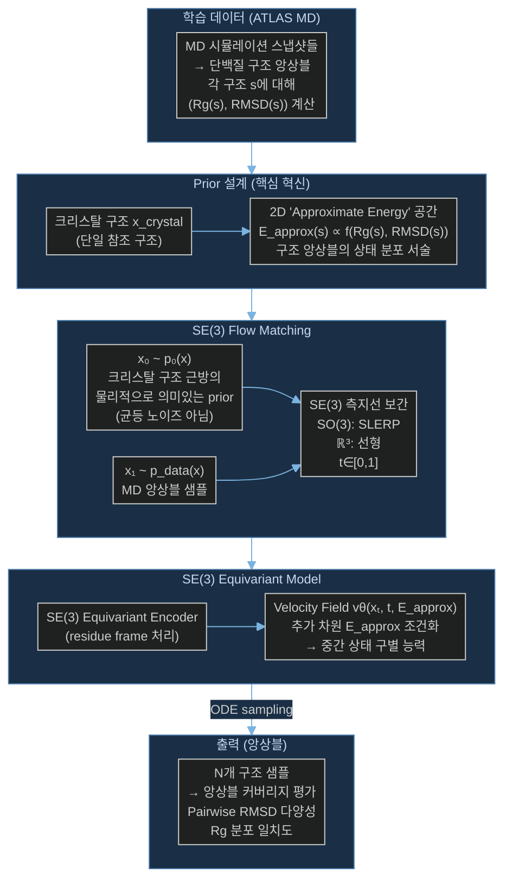

# Paper — P2DFlow: SE(3) Flow Matching을 이용한 단백질 구조 앙상블 생성

## 메타

- **저자**: Yaowei Jin, Qi Huang, Ziyang Song, Mingyue Zheng, Dan Teng, Qian Shi
- **Venue / Year**: Journal of Chemical Theory and Computation (JCTC), 2025
- **Link**: https://arxiv.org/abs/2411.17196
- **Code**: GitHub (공개)
- **Tier**: Should-cite
- **관련 프로젝트**: [[../../1_Projects/Crypticflow/README]]

## TL;DR (3줄)

1. 단일 구조가 아닌 단백질 **구조 앙상블** 전체를 SE(3) flow matching으로 생성하는 P2DFlow 제안.
2. 핵심 아이디어: Rg(회전 반경)×RMSD 2D 공간을 "approximate energy"로 해석 — 앙상블의 중간 상태를 구별하는 추가 차원 도입.
3. ATLAS MD 데이터셋에서 학습·평가, 다양한 baseline 대비 앙상블 커버리지 및 동적 변동 재현에서 우수.

## 핵심 아키텍처

## 문제 정의 (Problem)

- 단백질의 생물학적 기능은 **단일 평형 구조** 가 아닌 **구조 앙상블(ensemble)** 에 의해 결정됨
- 기존 구조 예측 모델(AlphaFold2 등)은 단일 구조만 출력 → 동적 거동 미반영
- MD 시뮬레이션은 정확하지만 계산 비용이 극도로 높음 → 대규모 스크리닝 불가
- 기존 생성 모델은 앙상블의 **중간 상태들을 구별하지 못함** → 단순한 분포 샘플링에 그침

## 핵심 아이디어 (Method)

### 1. ATLAS MD 데이터셋
- ATLAS: 대규모 MD 시뮬레이션 데이터베이스 (다양한 단백질의 수십~수백 나노초 궤적)
- 각 단백질에 대해 수천 개의 구조 스냅샷 → 학습용 앙상블 구성
- 크리스탈 구조를 참조(reference) 구조로 사용

### 2. 2D Approximate Energy 공간 (핵심 혁신)
- 각 구조 상태 s에 대해 두 물리적 지표 계산:
  - **Rg (Radius of gyration)**: 단백질 전체 구조의 컴팩트함 척도
  - **RMSD**: 크리스탈 구조 대비 변형 정도
- `(Rg, RMSD)` 2D 공간 = "approximate energy landscape"
- 이 공간에서 서로 다른 위치의 구조들은 **다른 conformational state** 에 해당
- 모델이 이 추가 차원을 조건으로 받아 앙상블 내 개별 상태를 구별

### 3. 물리 기반 Prior 설계
- 일반적 flow matching: prior = 균등 가우시안 노이즈
- P2DFlow: 크리스탈 구조 근방의 **물리적으로 의미있는 prior** 사용
- 크리스탈 구조에서 작은 perturbation → MD 시뮬레이션 시작점과 유사한 분포
- 더 짧고 효율적인 flow path, 물리적으로 타당한 샘플 생성

### 4. SE(3) Flow Matching
- FrameFlow / FoldFlow와 동일한 SE(3) frame 표현
- SO(3): SLERP 측지선 보간, ℝ³: 선형 보간
- Velocity field를 Lie algebra se(3)에서 예측

### 5. 앙상블 평가 지표
- **Pairwise RMSD**: 생성된 앙상블 내 구조 다양성
- **Rg 분포**: 크기 분포의 MD 일치도
- **앙상블 커버리지**: MD에서 관찰된 conformation을 얼마나 커버하는가

## 실험 결과 (Results)

| 모델 | 앙상블 커버리지 | Rg 분포 일치 | Pairwise RMSD 다양성 |
|------|----------------|-------------|---------------------|
| AlphaFold2 (단일) | 낮음 | 낮음 | 없음 |
| ESMFold (단일) | 낮음 | 낮음 | 없음 |
| EnsembleFlow (baseline) | 보통 | 보통 | 보통 |
| **P2DFlow** | **최우수** | **최우수** | **MD와 유사** |

- 크리스탈 구조 및 MD 시뮬레이션에서 관찰되는 동적 변동 포착 성공
- MD 대리 에이전트(surrogate)로 활용 시 계산 비용 수천~수만 배 절감
- 단백질 기능 관련 allosteric 변화, loop 유연성 재현

## 강점 / 약점

**Strengths**

- 단순 단일 구조가 아닌 전체 앙상블 생성 — 단백질 동역학 모델링
- 2D approximate energy 공간 도입으로 앙상블 내 상태 구별 능력 부여
- 물리 기반 prior로 MD 시뮬레이션과 유사한 분포 달성
- ATLAS 대규모 데이터 활용으로 일반화 능력 확보
- MD 대리 에이전트로 직접 활용 가능

**Weaknesses**

- **단방향성 없음**: apo→holo 단방향 변화가 아닌, 단백질 전체 구조 앙상블 생성
- Rg×RMSD prior가 모든 단백질에 보편적으로 적합한지 불명확
- ATLAS 데이터셋에 포함된 단백질에 편향 가능
- Cryptic pocket처럼 특정 conformation 타겟팅이 아닌, 전반적 앙상블 생성

## 우리 연구와의 연결 고리

- **문제 1 해결 (Loss-RMSD 불일치 / NERF lever arm effect)**:
  - P2DFlow도 SE(3) frame 표현 + 측지선 보간 → NERF 없이 lever arm effect 회피
  - 앙상블 생성에서의 SE(3) flow가 apo→holo 단방향 예측에도 동일하게 적용됨을 지지
  - CrypticFlow가 Loss와 RMSD 불일치 시 → SE(3) frame으로 전환하는 추가 근거 제공

- **문제 2 (비연속 서열 / chain break 처리)**:
  - ATLAS MD 데이터는 실제 실험 구조 기반 → multi-chain 단백질 포함 가능
  - 앙상블 생성 프레임워크에서 chain break 처리 방법은 FrameFlow와 유사하게 미상세
  - P2DFlow의 residue-level frame 처리 방식에서 chain break 마스킹 전략 참조 가능

- **문제 3 (DiT 확장성 한계)**:
  - SE(3) equivariant encoder 구조 — 구체적 아키텍처는 논문 본문 확인 필요
  - 앙상블 생성의 고품질을 위해 모델 크기보다 prior 설계와 조건화 방식이 중요함을 시사

- **방법론적 연결 — 앙상블 vs 단방향 예측 비교**:
  - P2DFlow: 자유로운 앙상블 샘플링 (방향성 없음)
  - CrypticFlow: apo 조건부로 holo를 **단방향** 예측
  - 비교 논점: CrypticFlow가 P2DFlow 앙상블에서 holo-like 구조를 얼마나 잘 포착하는가?

- **MD 데이터셋 구축 방법 참조**:
  - ATLAS 데이터셋 구성 방법론 → CrypticFlow 학습용 apo/holo pair 데이터 확장에 응용
  - MD 앙상블에서 대표 구조 선택 전략 (Rg×RMSD 기반 클러스터링)

## 인용할 만한 문장

> "Biological processes, functions, and properties are more closely linked to ensembles of protein structures rather than single stable structures."

> "We design a valuable prior for the flow process and incorporate additional dimensions to describe ensemble data, improving the model's ability to distinguish between intermediate states."

> "P2DFlow successfully captures dynamic fluctuations observed in crystal structures and MD simulations, outperforming baselines in extensive experiments."

## 추가로 읽을 참고문헌

- [ ] [[Paper_Yim23_FrameFlow]] — SE(3) flow matching 방법론 기반
- [ ] [[Paper_Bose24_AlphaFlow]] — AlphaFlow: AlphaFold2 기반 앙상블 생성 (직접 비교 baseline)
- [ ] [[Paper_Zhou25_DynamicFlow]] — apo→holo 방향성 있는 conformation flow (비교 관점)
- [ ] [[Paper_Sesame25_ApoHolo]] — CrypticFlow와 동일 task
