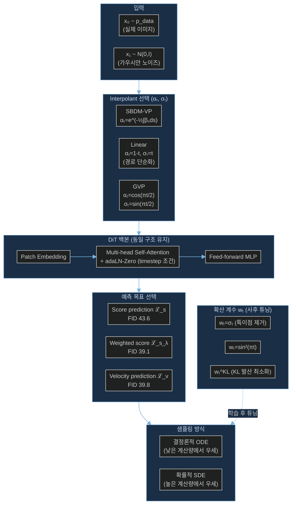

# Paper — SiT: Exploring Flow and Diffusion-based Generative Models with Scalable Interpolant Transformers

## 메타

- **저자**: Nanye Ma, Mark Goldstein, Michael S. Albergo, Nicholas M. Boffi, Eric Vanden-Eijnden, Saining Xie
- **Venue / Year**: ECCV 2024
- **Link**: https://arxiv.org/abs/2401.08740
- **Code**: https://github.com/willisma/SiT
- **Tier**: Skim
- **관련 프로젝트**: [[../../1_Projects/Crypticflow/README]]

## TL;DR (3줄)

1. DiT 아키텍처를 그대로 유지한 채 **interpolant framework**를 도입 — diffusion과 flow matching을 단일 프레임워크로 통합.
2. 4가지 설계 선택(interpolant 유형 / 예측 목표 / 확산 계수 / 샘플링 방식)을 독립적으로 분리하여 체계적으로 탐구.
3. ImageNet 256×256에서 **FID 2.06** 달성 — 동일 아키텍처·파라미터·GFLOPs의 DiT 대비 전 규모에서 균일하게 우세.

## 핵심 아키텍처



## 문제 정의 (Problem)

DiT(Diffusion Transformer)는 강력하지만:
- Diffusion과 flow matching이 별개 프레임워크로 존재 → 체계적 비교 어려움
- Noise schedule, 예측 목표, 샘플링 방식이 서로 묶여(entangled) 있어 독립적 분석 불가
- Flow matching의 이론적 이점(직선 경로, 빠른 수렴)이 실제로 얼마나 유효한지 불명확

목표: 단일 프레임워크에서 설계 선택지를 분리하여 최적 조합을 탐색하고 flow matching의 실증적 이점을 정량화.

## 핵심 아이디어 (Method)

### Interpolant Framework
임의의 두 분포를 연결하는 일반화된 프레임워크:

```
xₜ = αₜ · x₀ + σₜ · x₁ + γₜ · ε,  ε ~ N(0,I)
```

- **αₜ, σₜ**: interpolant 함수 (데이터 → 노이즈 경로 결정)
- **γₜ**: 추가 확률론적 성분 (SDE 경우)
- 표준 diffusion(SBDM-VP)과 flow matching(Linear)이 모두 이 형식의 특수 케이스

### 4가지 독립 설계 선택

| 차원 | 옵션 | 최적 선택 |
|------|------|----------|
| Interpolant | VP / Linear / GVP | Linear 또는 GVP |
| 예측 목표 | score / weighted score / velocity | velocity (Linear에서) |
| 확산 계수 wₜ | σₜ / sin²(πt) / wKL / wKL,η | wKL,η (Linear에서) |
| 샘플링 | ODE / SDE | 계산 예산에 따라 선택 |

### Score-Velocity 변환 관계
```
s(x,t) = σₜ⁻¹ · [αₜv(x,t) − ȧₜx] / [ȧₜσₜ − αₜσ̇ₜ]
```
학습된 표현 간 사후 변환 가능 → 한 번 학습 후 다양한 샘플링 전략 실험.

### Linear Interpolant의 이점
- αₜ=1-t, σₜ=t → ODE 경로가 직선에 가까워짐
- 곡률 감소 → 수치 적분 오차 감소 → 더 적은 NFE(함수 평가)로 동등 품질

## 실험 결과 (Results)

| 셋업 | 메트릭 | 값 |
|------|--------|-----|
| SiT-XL/2, ImageNet 256×256 | FID-50K | **2.06** |
| SiT-XL/2, ImageNet 512×512 | FID-50K | **2.62** |
| SiT-B/2, 400K steps | FID-50K | 33.0 |
| DiT-B/2, 400K steps (비교) | FID-50K | 43.5 |
| 차이 | 개선폭 | **△10.5 FID** |

- 모든 모델 크기(S/B/L/XL)에서 동일 DiT 구성 대비 균일하게 우세
- 하이퍼파라미터 튜닝 없음 (동일 DiT 설정 그대로 사용)

## 강점 / 약점

**Strengths**

- DiT 백본 변경 없이 프레임워크만 교체 → 기존 DiT 코드베이스에 즉시 적용 가능
- Interpolant 선택이 학습 후 샘플링 단계에서 튜닝 가능 → 재학습 불필요
- 이론적으로 엄밀한 통합 프레임워크 (score-velocity 변환 관계 도출)
- FID 2.06: ImageNet 256×256 SOTA 수준

**Weaknesses**

- 이미지 도메인 전용 검증 — 단백질 구조 같은 비유클리드 공간 적용 가능성은 미검증
- Linear interpolant가 왜 더 좋은지에 대한 직관적 설명 부족 (수식 위주)
- 확산 계수 wₜ 선택이 복잡 → 실무 사용 시 추가 탐색 필요

## 우리 연구와의 연결 고리

### 문제 3 (DiT 확장성 한계) — 이론적 배경

- **DiT → Flow Matching 전환의 근거**: SiT가 증명한 핵심 — DiT 백본을 그대로 유지하면서 interpolant만 교체해도 성능이 유의미하게 향상됨. CrypticFlow가 현재 DiT 구조를 유지하면서 flow matching으로 전환하는 결정의 **직접적 실증 근거**.
- **Velocity prediction 우위**: Linear interpolant + velocity prediction 조합이 score prediction보다 우월 → CrypticFlow의 loss 함수 설계 시 velocity 기반 목표 채택 근거
- **ODE vs SDE 선택 지침**: 단백질 생성에서 샘플링 예산에 따라 결정론적/확률론적 sampler 선택 방향 제시

### 문제 1 (Loss-RMSD 불일치) — 간접 관련

- Weighted score loss `ℒ_s_λ`가 σₜ⁻¹ 특이점 근처(t→0, 즉 데이터 근방)에서 gradient 소실을 보정 → CrypticFlow의 RMSD가 낮은 영역(정확한 구조 근방)에서 loss 신호가 약해지는 문제와 구조적으로 유사
- Linear interpolant의 직선 경로 → angle space에서의 loss landscape가 더 평탄해질 가능성

### 문제 2 (비연속 서열 처리) — 무관

- SiT는 이미지 패치 기반 → chain break 개념 없음. 직접 적용 불가.

## 인용할 만한 문장

> "SiT achieves FID of 2.06 on class-conditional ImageNet 256×256 generation, uniformly outperforming DiT across all model sizes with identical architecture, parameters, and GFLOPs."

> "The interpolant framework decouples four design dimensions — interpolant specification, model parameterization, diffusion coefficient, and sampling scheme — enabling independent exploration of each."

> "Linear and GVP interpolants outperform SBDM-VP by reducing ODE trajectory curvature, thereby lowering discretization errors during sampling."

## 추가로 읽을 참고문헌

- [ ] [[Paper_Bose23_FoldFlow]] — SE(3) 위 flow matching 적용 사례 (SiT의 단백질 도메인 확장)
- [ ] DiT 원논문 (Peebles & Xie 2023) — SiT의 백본 아키텍처 출처
- [ ] Albergo & Vanden-Eijnden (2023) — Stochastic interpolant 이론적 기반
- [ ] [[Paper_Zhao25_DyDiT]] — SiT 위에서 동적 계산 효율화 (DyDiT++가 SiT에도 적용됨)
