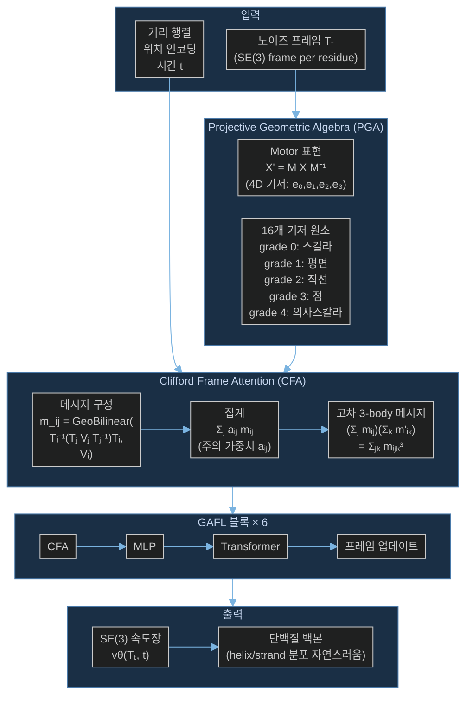

# Paper — GAFL: Generating Highly Designable Proteins with Geometric Algebra Flow Matching

## 메타

- **저자**: Simon Wagner, Leif Seute, Vsevolod Viliuga, Nicolas Wolf, Frauke Gräter, Jan Stühmer
- **Venue / Year**: NeurIPS 2024
- **Link**: https://arxiv.org/abs/2411.05238
- **Code**: 미공개 (논문에 코드 링크 없음)
- **Tier**: Should-cite
- **관련 프로젝트**: [[../../1_Projects/Crypticflow/README]]

## TL;DR (3줄)

1. AlphaFold2의 IPA(Invariant Point Attention)를 **Clifford Frame Attention(CFA)** 으로 대체 — projective geometric algebra로 고차 bilinear message passing 구현.
2. FrameFlow flow matching 프레임워크에 통합, 자연 단백질의 이차 구조 분포(helix/strand 비율)를 충실히 재현.
3. designability 0.88 (FrameFlow 0.85 대비 +3%p), 추론 시간 8.8초 (RFDiffusion 21.0초 대비 2.4×빠름).

## 핵심 아키텍처

## 문제 정의 (Problem)

- 기존 단백질 생성 모델(RFDiffusion, FrameDiff, FrameFlow)은 높은 designability를 달성하지만 **이차 구조(helix/strand) 분포가 자연 단백질과 다름** — 특히 β-strand 함량이 과소 생성됨.
- IPA(Invariant Point Attention)는 3D 좌표를 **선형으로만** 조합 → 잔기 간 기하학적 관계(상대 회전, 비틀림 등)를 고차 항으로 포착하지 못함.
- SE(3) 등변성을 유지하면서도 더 표현력 있는 attention 메커니즘이 필요.

## 핵심 아이디어 (Method)

### 1. Projective Geometric Algebra (PGA) 표현

**기저 공간**: 4차원 ℝ⁴, 기저 {e₀, e₁, e₂, e₃}
- 이차형식: $q(e_1) = q(e_2) = q(e_3) = 1$, $q(e_0) = 0$ (e₀는 무한원점)

**16개 기저 원소의 기하학적 의미**:

| Grade | 원소 수 | 기하학적 객체 |
|-------|--------|-------------|
| 0 | 1 | 스칼라 |
| 1 | 4 | 평면 (벡터) |
| 2 | 6 | 직선 (이중벡터) |
| 3 | 4 | 점 (삼중벡터) |
| 4 | 1 | 의사스칼라 |

**Motor 표현**: 각 잔기 프레임 $T_i \in SE(3)$를 회전 후 평행이동을 나타내는 멀티벡터 Motor $M$으로 표현:

$$X' = M X M^{-1}$$

→ SE(3) 변환이 대수의 sandwich product로 표현됨 → 미분 가능, 효율적 계산.

### 2. Clifford Frame Attention (CFA)

**핵심 메시지 패싱 수식**:

$$m_{ij}^{(h,p)} = \text{GeoBilinear}\!\left(T_i^{-1}(T_j V_j^{(h,p)} T_j^{-1})T_i,\; V_i^{(h,p)}\right)$$

- $T_i^{-1}(\cdots)T_i$: node $j$의 값을 node $i$의 로컬 프레임으로 변환 (상대 기하학 포착).
- `GeoBilinear`: PGA의 기하학적 곱(geometric product)과 join 연산 — **비선형 고차 항** 생성.

**집계**:

$$\sum_j a_{ij}^h m_{ij}^{(h,p)} = \text{GeoBilinear}\!\left(T_i^{-1}\sum_j a_{ij}^h(T_j V_j^{(h,p)} T_j^{-1})T_i,\; V_i^{(h,p)}\right)$$

- 합과 bilinear 레이어 교환 가능 → 계산 효율성 유지.

**3-body 고차 메시지**:

$$\left(\sum_j m_{ij}\right)\!\left(\sum_k m'_{ik}\right) = \sum_{jk} m_{ij} m'_{ik} \equiv \sum_{jk} m_{ijk}^{(3)}$$

→ 두 이웃 잔기의 기하학적 관계를 동시에 포착하는 3-body interaction.

### 3. IPA와의 비교

| 특성 | IPA (AlphaFold2) | CFA (GAFL) |
|------|-----------------|-----------|
| 특성 공간 | 3D 포인트 (ℝ³) | PGA 멀티벡터 (ℝ¹⁶) |
| 메시지 구성 | 선형 조합 | 기하학적 bilinear 연산 |
| 고차 항 | 없음 | 있음 (grade 0~4) |
| 상대 프레임 | 제한적 | 완전 (sandwich product) |
| 표현력 | 낮음 | 높음 |

### 4. FrameFlow 통합

- **FrameFlow 프레임워크** (SE(3) flow matching) 기반.
- FrameDiff/FrameFlow의 **IPA 블록을 CFA로 교체**.
- 전체 구조: 6개 블록 (CFA → MLP → Transformer → 프레임 업데이트) × 6.
- 입력: 노이즈 프레임 $T_t$, 거리 행렬, 위치 인코딩, 시간 $t$.
- 출력: SE(3) 속도장 $v_\theta(T_t, t) \in se(3)$.

## 실험 결과 (Results)

### PDB 데이터셋 (길이 60-300)

| 모델 | Designability ↑ | Diversity ↓ | Novelty ↓ | Helix | Strand | 추론 시간(s) |
|------|----------------|------------|----------|-------|--------|------------|
| **GAFL** | **0.88 ±0.01** | 0.36 ±0.00 | 0.71 ±0.00 | 0.53 | **0.25** | **8.8** |
| RFDiffusion | 0.89 ±0.01 | 0.37 ±0.00 | 0.74 ±0.00 | 0.58 | 0.24 | 21.0 |
| FrameFlow | 0.85 ±0.01 | 0.35 ±0.00 | 0.70 ±0.00 | 0.56 | 0.20 | 6.6 |

- GAFL strand 함량(0.25) > FrameFlow(0.20) — 자연 단백질 분포 더 잘 재현.

### Ablation (SCOPe-128 데이터셋)

| 설정 | Designability |
|------|--------------|
| **GAFL 전체 (CFA)** | **90.5%** |
| CFA 없음 (IPA만) | 88.2% |
| 개선 | **+2.3%p** |

### 장체인 (길이 450-500)

- GAFL: designability **0.74** 달성 (RFDiffusion 수준 유지).

## 강점 / 약점

**Strengths**

- PGA bilinear message passing으로 SE(3) 등변성 + 고차 기하학 정보 동시 획득.
- 이차 구조 분포가 자연 단백질에 가장 가까움 — 실용적 단백질 설계에 유리.
- 추론 속도 빠름 (RFDiffusion 대비 2.4×).
- FrameFlow에 모듈식 교체 — 기존 프레임워크와 호환.

**Weaknesses**

- CFA 이득이 +2.3%p로 크지 않음 (IPA 대비 marginal 개선).
- 코드 미공개 — 재현 어려움.
- 서열 조건부 생성 없음.
- 파라미터 수 작음 (대형 모델 확장성 미검증).
- PGA 구현 복잡도 높음 — 실용 채택 장벽.

## 우리 연구와의 연결 고리

- **문제 3 (DiT 확장성 한계)**: CrypticFlow의 adaLN-Zero DiT(d=256, 6층) 대신 SE(3) 전환 시 attention 아키텍처 선택지로 CFA 직접 고려 가능. IPA → CFA 교체로 기하학적 표현력 향상.
- **IPA 대안 탐색**: 현재 CrypticFlow가 angle space에서 학습하는 이유 중 하나가 SE(3) attention 구현 복잡성 — CFA는 FrameFlow 위에서 모듈식 교체로 구현 가능한 현실적 대안.
- **FrameFlow + CFA 조합**: CrypticFlow가 SE(3) 전환 시 FrameFlow 프레임워크 + CFA attention이 아키텍처 개선의 구체적 방향. [[Paper_Bose23_FoldFlow]] SE(3) 기반 + CFA attention으로 발전.
- **이차 구조 분포 재현**: apo-holo 전환에서 holo 구조의 β-strand 함량 변화 포착에 GAFL의 기하학적 메시지 패싱 유리할 수 있음.
- [[Paper_NVIDIA25_Proteina]] — non-equivariant 대형 모델과 equivariant CFA 간 트레이드오프 비교 관점.

## 인용할 만한 문장

> "We propose Clifford Frame Attention (CFA), which uses the bilinear operations of the algebra to construct geometrically expressive messages between residues."

> "GAFL follows the secondary structure element distribution of naturally occurring proteins — a feature insufficiently achieved by many recent state-of-the-art models."

## 추가로 읽을 참고문헌

- [ ] [[Paper_Bose23_FoldFlow]] — FrameFlow 기반 (GAFL이 통합하는 프레임워크)
- [ ] [[Paper_Yim23_FrameDiff]] — IPA Transformer 원본 (CFA가 교체하는 대상)
- [ ] [[Paper_NVIDIA25_Proteina]] — non-equivariant 대안 비교
- [ ] [[Paper_Huguet24_FoldFlow2]] — 서열 조건부 SE(3) flow (CFA와 결합 가능)
