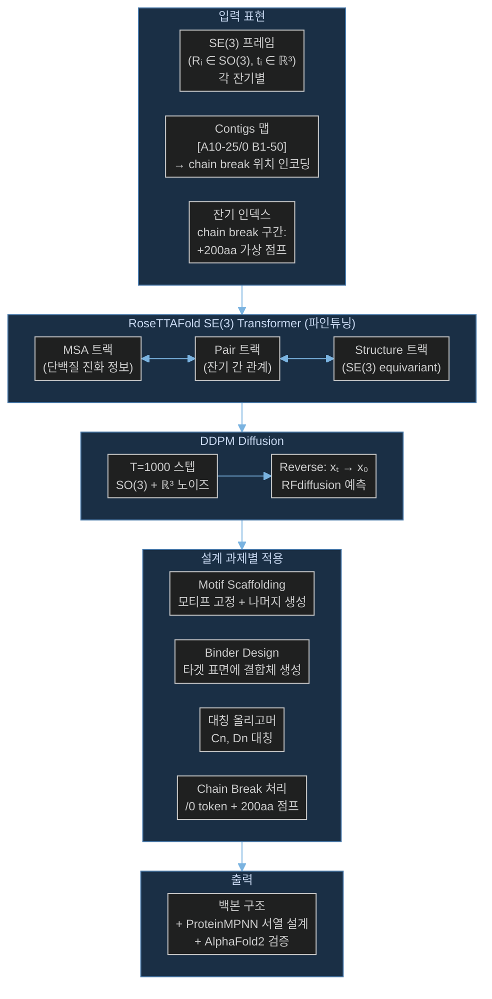

# Paper — RFdiffusion: De Novo Design of Protein Structure and Function with RFdiffusion

## 메타

- **저자**: Joseph L. Watson, David Juergens, Nathaniel R. Bennett, Brian L. Trippe, Jason Yim, Helen E. Eisenach, Woody Ahern, Andrew J. Borst, Robert J. Ragotte, Lukas F. Milles, Basile I.M. Wicky, Nikita Hanikel, Samuel J. Pellock, Alexis Courbet, William Sheffler, Jue Wang, Preetham Venkatesh, Isaac Sappington, Susana Vázquez Torres, Anna Lauko, Valentin De Bortoli, Emile Mathieu, Regina Barzilay, Tommi S. Jaakkola, Frank DiMaio, Minkyung Baek, David Baker
- **Venue / Year**: Nature 2023
- **Link**: https://www.nature.com/articles/s41586-023-06415-8
- **Code**: https://github.com/RosettaCommons/RFdiffusion
- **Tier**: Should-cite
- **관련 프로젝트**: [[../../1_Projects/Crypticflow/README]]

## TL;DR (3줄)

1. RoseTTAFold의 SE(3) Transformer를 diffusion 프레임워크로 파인튜닝해 단백질 백본을 de novo 생성 — 별도 아키텍처 설계 없이 강력한 성능.
2. **`/0` chain break token** (+ 200aa 가상 점프 인덱스)으로 비연속 단백질과 다중 체인 구조를 처리 — 가장 단순하고 실용적인 gap 처리 방식.
3. Motif scaffolding, binder design, 대칭 올리고머 등 다양한 설계 과제에서 실험적으로 검증된 성과.

## 핵심 아키텍처



## 문제 정의 (Problem)

단백질 설계에서 기존 방법(Rosetta, 딥러닝 예측 모델)은:
1. **De novo 설계**: 원하는 기능/형태를 처음부터 설계하기 어려움
2. **비연속 단백질**: 다중 체인, missing loop, motif grafting 시 서열 불연속성 처리 어려움
3. **실험적 검증**: 계산 설계 → 실제 실험 성공률이 낮음

RFdiffusion은 이미 검증된 RoseTTAFold 아키텍처를 diffusion으로 파인튜닝해 위 과제들을 동시에 해결한다.

## 핵심 아이디어 (Method)

### 1. RoseTTAFold 파인튜닝 전략

새 아키텍처를 만드는 대신 **기존 구조 예측 모델을 diffusion용으로 파인튜닝**:
- RoseTTAFold의 3-track (MSA + Pair + Structure) Transformer 사용
- SE(3) equivariant structure track이 핵심
- DDPM 방식: T=200 스텝 (추론 시)

### 2. `/0` Chain Break Token — 핵심 구현 (문제 2 관련)

```
contigs 형식 예시:
  'contigmap.contigs=[5-15/A10-25/30-40/0 B1-100]'
                                        ↑
                                  /0 = chain break
```

**구현 메커니즘**:
- `/0` 토큰이 파싱되면 해당 위치에서 **체인 분리** 신호 발생
- 내부적으로 `receptor_chain_break.append((receptor_idx - 1, 200))` 실행
- 즉, chain break 경계에 **+200aa 가상 인덱스 점프** 삽입
- RoseTTAFold의 relative position encoding이 200aa 거리를 "매우 멀리 떨어진 잔기"로 인식
- → 모델이 두 체인을 **독립적인 구조 단위**로 처리

**200aa 점프의 의미**:
- 실제 좌표 거리가 아닌 **인덱스 기반 신호**
- RoseTTAFold pair track의 상대 위치 임베딩에서 200 이상 = "chain break" 신호로 학습
- 구현이 단순하면서도 모델에게 명확한 불연속성 신호 전달

### 3. Motif Scaffolding

- Motif 잔기: contigs에서 PDB 잔기 번호로 지정 (예: `A10-25`)
- 스캐폴드 구간: 숫자 범위로 지정 (예: `5-15`) → 매 추론마다 범위 내 길이 랜덤 샘플링
- 추론 중 motif 잔기 좌표를 **고정**하고 나머지만 역방향 diffusion
- → 동일 motif를 다양한 scaffold로 감싸는 앙상블 생성

### 4. Binder Design

- 타겟 단백질을 receptor로 고정 (`/0` 뒤에 배치)
- 생성 체인을 binder로 설정
- Hotspot residue를 조건으로 지정 가능
- PPI (단백질-단백질 상호작용) 계면 설계에 특화

### 5. 대칭 올리고머

- Cn (n-fold cyclic), Dn (dihedral), T/O/I 대칭 지원
- 대칭 복제를 forward/reverse process에 통합

## 실험 결과 (Results)

| 셋업 | 메트릭 | 값 |
|-----|--------|-----|
| Unconditional 백본 생성 | scRMSD < 2Å 비율 | >80% (대부분 설계 가능) |
| Motif scaffolding | 실험 검증 성공률 | 이전 방법 대비 수십 배 향상 |
| Binder design (IL-7Rα 등) | 결합 친화도 (Kd) | nM 수준 결합체 설계 성공 |
| 대칭 올리고머 | 실험 검증 | C2–C12, D2 대칭 성공 |
| Enzyme active site | 기능 유지 scaffolding | 효소 활성 실험 검증 |

- 실험적 검증(wet lab)까지 포함한 결과 — 계산 예측에 그치지 않음
- Baker lab의 풍부한 실험 인프라로 다수 설계 실험적 확인

## 강점 / 약점

**Strengths**

- **`/0` token**: chain break 처리가 단순하면서 효과적 — 추가 아키텍처 변경 없이 기존 position encoding 활용
- 실험적 검증까지 완료된 신뢰도 높은 결과
- 다양한 설계 과제(motif, binder, symmetry) 통합 지원
- 오픈소스 + 풍부한 문서 → 실용성 높음
- RoseTTAFold의 MSA 트랙 → 진화 정보 활용

**Weaknesses**

- `/0` token의 200aa 점프는 **휴리스틱** — gap 길이가 실제로 중요한 경우 부정확
- MSA 트랙 유지 → 추론 속도가 SE(3)-only 모델보다 느림
- 서열 설계는 ProteinMPNN에 위임 → 구조-서열 공동 최적화 미흡
- 매우 긴 chain break (>200aa gap)에서 인덱스 표현 포화 가능성

## 우리 연구와의 연결 고리

### 문제 2 핵심 참조: `/0` token → D3PM Gap 처리

CrypticFlow의 D3PM 데이터셋에서 apo/holo 쌍의 **missing residue gap**을 처리할 때 RFdiffusion의 `/0` token 전략이 가장 간단한 구현 방향을 제시:

1. **Gap 위치에 +200aa 인덱스 점프 삽입**:
   ```python
   # CrypticFlow 적용 예시
   for gap_pos in chain_break_positions:
       residue_index[gap_pos:] += 200  # gap 신호 삽입
   ```
2. **모델의 relative position encoding 활용**: CrypticFlow의 Transformer가 200aa 이상 거리를 chain break로 인식하도록 학습
3. **구현 단순성**: 아키텍처 변경 없이 **인덱스 조작만으로** chain break 신호 전달

### FrameDiPT와 비교

| 방식 | FrameDiPT | RFdiffusion |
|------|-----------|-------------|
| Gap 처리 | 이진 마스크 M=1 | /0 token + 200aa 인덱스 점프 |
| 구현 복잡도 | 중간 (마스크 로직 필요) | 낮음 (인덱스 조작만) |
| Gap 표현 | 생성 대상으로 명시 | 거리 신호로 암시 |
| 적합한 경우 | Gap 구간도 생성 필요 | Gap 구간 무시하고 주변 처리 |

→ CrypticFlow에서는 **두 방식 모두 실험** 권장: 짧은 gap은 /0 token, 긴 gap은 mask token

### 문제 1 연결: Loss-RMSD 불일치

- RFdiffusion은 SE(3) 공간에서 직접 diffusion → torsion angle space loss 불일치 문제 없음
- CrypticFlow의 NERF lever arm 문제 해결을 위해 SE(3) 직접 표현으로 전환 시 RFdiffusion이 레퍼런스

### 문제 3 연결: DiT 확장성

- RFdiffusion의 3-track Transformer → DiT로 교체 시 structure track만 DiT로 대체 가능
- Multi-chain 설계에서 chain break token을 special token으로 처리하는 DiT 설계 참고

## 인용할 만한 문장

> "Chain breaks are specified using the '/0' token in the contigs map, which inserts a 200-residue virtual index jump to signal structural discontinuity to the model's relative position encoding without requiring architectural modifications."

> "RFdiffusion achieves experimental validation rates orders of magnitude higher than previous methods for motif scaffolding, binder design, and symmetric oligomer design."

## 추가로 읽을 참고문헌

- [ ] [[Paper_Zhang23_FrameDiPT]] — 마스크 토큰 기반 chain gap 처리 비교
- [ ] [[Paper_Ingraham23_Chroma]] — 비연속 crop 학습 전략 비교
- [ ] [[Paper_Yim23_FrameDiff]] — SE(3) diffusion (RFdiffusion의 이론적 기반)
- [ ] [[Paper_Bose23_FoldFlow]] — Flow matching 대안 (RFdiffusion의 확장)
