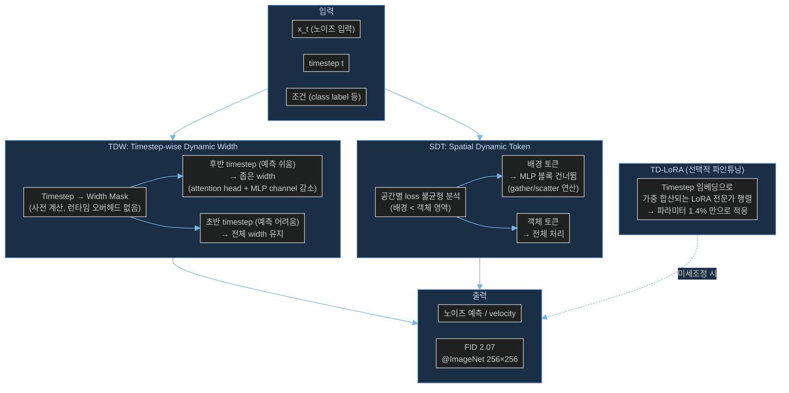

# Paper — DyDiT++: Diffusion Transformers with Timestep and Spatial Dynamics for Efficient Visual Generation

## 메타

- **저자**: Wangbo Zhao, Yizeng Han, Jiasheng Tang, Kai Wang, Hao Luo, Yibing Song, Gao Huang, Fan Wang, Yang You
- **Venue / Year**: IEEE TPAMI (Transactions on Pattern Analysis and Machine Intelligence), 2026년 수락
- **Link**: https://arxiv.org/abs/2504.06803
- **Code**: 미공개 (제출 시점 기준)
- **Tier**: Skim
- **관련 프로젝트**: [[../../1_Projects/Crypticflow/README]]

## TL;DR (3줄)

1. DiT의 정적 추론 패러다임을 **동적**으로 바꾸는 두 메커니즘 제안: **TDW**(timestep별 width 조정) + **SDT**(공간별 토큰 선택적 처리).
2. DiT-XL 대비 **51% FLOPs 절감**, **1.73× 하드웨어 가속**으로 ImageNet FID 2.07 달성.
3. DiT, SiT, Latte(비디오), FLUX(텍스트→이미지)까지 범용 적용 가능성 실증.

## 핵심 아키텍처

## 문제 정의 (Problem)

DiT(Diffusion Transformer)는 고품질 생성을 달성했지만:
- **정적 추론**: 모든 timestep, 모든 공간 위치에 동일한 계산량 적용 → 비효율
- **Timestep 불균형**: 후반 diffusion step은 예측이 쉬움(loss 작음)에도 전체 capacity 사용
- **공간 불균형**: 배경 영역은 객체 영역보다 훨씬 단순함에도 동일 처리
- 결과: 불필요한 FLOPs 낭비 → 특히 긴 시퀀스(고해상도 이미지, 장쇄 단백질)에서 심각

목표: 계산을 "어려운 곳"에 집중하고 "쉬운 곳"은 건너뛰어 품질 손실 없이 대폭 가속.

## 핵심 아이디어 (Method)

### 1. TDW: Timestep-wise Dynamic Width
- Diffusion 후반 timestep일수록 각 블록의 **attention head 수**와 **MLP channel 수**를 줄임
- Timestep → Width 매핑을 **사전 계산**(lookup table) → 런타임 오버헤드 제로
- 구현: `gating score`로 head/channel 중요도 순위 → 상위 ρ% 만 활성화
- 직관: "t가 크면(노이즈 많음) 어렵다 → 넓게 처리. t가 작으면 쉽다 → 좁게 처리"

### 2. SDT: Spatial Dynamic Token
- 각 이미지 패치(토큰)의 예측 난이도를 **loss 지도**로 사전 분석 → 불균형 확인
- 쉬운 토큰(배경 등) → **MLP 블록 완전 건너뜀** (self-attention은 유지)
- 구현: gather → 선택된 토큰만 MLP 통과 → scatter → 원위치 복원
- Batch 호환성 유지: 토큰 수가 배치마다 다르더라도 패딩 없이 효율적 처리

### 3. TD-LoRA: Timestep-Dependent LoRA
- 기존 LoRA의 단일 low-rank 행렬 → **다수의 전문가 행렬**로 확장
- 각 전문가의 가중치를 timestep 임베딩으로 동적 계산
- 1.4% 파라미터로 적응형 미세조정 → 26% GPU 메모리 절감

### 범용 적용성
- DiT, [[Paper_Ma24_SiT|SiT]], Latte(비디오), FLUX(텍스트→이미지) 모두에서 효과 검증
- 구조 변경 없이 기존 모델에 플러그인 형태로 적용 가능

## 실험 결과 (Results)

| 셋업 | 메트릭 | DyDiT++ | DiT-XL |
|------|--------|---------|--------|
| ImageNet 256×256 | FID-50K | **2.07** | 2.27 |
| ImageNet 256×256 | FLOPs 절감 | **51%** | — |
| ImageNet 256×256 | 하드웨어 속도 | **1.73×** | 1× |
| Latte (비디오) | 가속비 | **1.62×** | 1× |
| FLUX (텍스트→이미지) | 가속비 | **1.59×** | 1× |
| TD-LoRA 미세조정 | FID | 2.23 | — |
| TD-LoRA 미세조정 | 파라미터 비율 | **1.4%** | 100% |

## 강점 / 약점

**Strengths**

- TDW + SDT 모두 **기존 아키텍처 변경 없이** 플러그인으로 적용 가능
- Timestep 사전 계산 → 런타임 결정 비용 없음 (진정한 무오버헤드 가속)
- 비디오/텍스트→이미지로의 범용성 입증
- TD-LoRA로 downstream 적응 비용도 감소

**Weaknesses**

- 공간 토큰 선택 기준(loss 지도)이 학습 데이터 의존 → 학습 분포 밖 입력에서 불안정 가능
- 단백질 구조처럼 공간적 의미가 이미지와 전혀 다른 도메인에서의 "배경" 정의가 불명확
- 51% FLOPs 절감이 실제 wall-clock 1.73×로 변환되는 과정에서 하드웨어 효율 손실 있음

## 우리 연구와의 연결 고리

### 문제 3 (DiT 확장성 한계) — 계산 효율화 방향

- **D3PM 최대 3,611 residue 처리**: CrypticFlow의 DiT 기반 모델에서 장쇄 단백질 처리 시 O(L²) 어텐션이 주요 병목 — DyDiT++의 SDT를 단백질 도메인에 적용하면 "쉬운 잔기(고정된 코어 영역)"는 건너뛰고 "어려운 잔기(루프, 힌지 영역)"에 집중 가능
- **TDW 아이디어 차용**: Diffusion 후반 step(구조가 거의 확정된 단계)에서 DiT width 감소 → CrypticFlow 추론 가속에 직접 적용 가능
- **SiT와의 호환성**: DyDiT++가 [[Paper_Ma24_SiT|SiT]]에서도 동작 → CrypticFlow가 DiT → flow matching(SiT 방식)으로 전환하더라도 DyDiT++ 가속 기법을 그대로 유지할 수 있음

### 문제 3 세부: 학습 vs 추론 가속

- **학습 가속**: TDW + SDT로 반복당 FLOPs 51% 절감 → 동일 epoch당 비용 감소. D3PM 규모 데이터셋 학습 시 실용적 이점
- **추론 가속**: 1.73× 가속 → 고처리량 conformation 샘플링 실용화

### 문제 1 (Loss-RMSD 불일치) — 간접 관련

- DyDiT++의 loss 불균형 분석("후반 timestep에서 loss 차이가 크게 줄어든다")이 CrypticFlow의 loss landscape 분석 방향 제시 — 어느 timestep/공간 영역에서 loss와 RMSD 불일치가 집중되는지 조사 가능

### 문제 2 (비연속 서열 처리) — 간접 관련

- SDT의 selective token 처리는 개념적으로 chain break 위치의 토큰을 다르게 처리하는 방향으로 확장 가능 — 단, 직접 적용은 아님

## 인용할 만한 문장

> "DyDiT++ reduces FLOPs by 51% on DiT-XL while achieving competitive FID of 2.07, through timestep-wise dynamic width and spatial-wise dynamic token mechanisms that eliminate static computational redundancy."

> "The loss differences diminish substantially for later timesteps, and noticeable imbalance in loss values exists across different spatial regions — justifying selective computation allocation."

> "TD-LoRA achieves competitive adaptation with only 1.4% trainable parameters by replacing standard low-rank matrices with timestep-conditioned expert matrices."

## 추가로 읽을 참고문헌

- [ ] [[Paper_Ma24_SiT]] — DyDiT++가 적용 범위를 확장한 SiT (flow matching 기반 DiT)
- [ ] DiT 원논문 (Peebles & Xie 2023) — DyDiT++의 기반 아키텍처
- [ ] Latte (Ma et al. 2024) — DyDiT++ 비디오 생성 확장 대상
- [ ] FLUX — DyDiT++ 텍스트→이미지 확장 대상 (1.59× 가속 검증)
