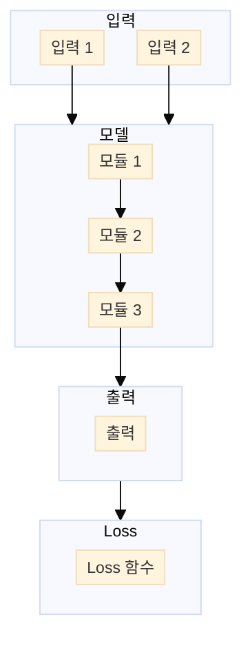

# Paper — {{Title}}

## 메타

- **저자**:
- **Venue / Year**:
- **Link**: arXiv / DOI
- **Code**: (GitHub URL 또는 "미공개")
- **Tier**: ⭐ Must-cite / Should-cite / Skim
- **관련 프로젝트**: [[../../1_Projects/Project_X/README]]

## TL;DR (3줄)

1.
2.
3.

## 핵심 아키텍처

> 빠른 스케치는 **Mermaid** (호버 시 1.7배 확대).
> 줌·드래그로 깊이 들여다봐야 하는 핵심 논문은 **Excalidraw** 섹션도 함께 사용.

### Mermaid (빠른 스케치)

![[Paper_Reading_Template_arch.png]]

📐 Mermaid source — 수정 후 <code>scripts/render_mermaids.sh</code> 재실행

### Excalidraw (인터랙티브, 선택)

> **만드는 법** (Must-cite 논문이나 본인 paper figure에 쓸 다이어그램만):
> 1. `Cmd+P` → **"Excalidraw: Create new drawing in current folder"**
> 2. 새로 열린 캔버스 우상단 햄버거 메뉴 → **"Insert mermaid diagram"**
> 3. 위 Mermaid 코드 그대로 복붙 → 자동으로 Excalidraw 도형으로 변환
> 4. 필요 시 색·라벨 위치·강조 화살표 등을 손으로 다듬고 저장
> 5. 파일명 예: `Paper_저자YY_arch.excalidraw` (이 노트와 같은 폴더에)
> 6. 아래 placeholder 줄을 실제 파일명으로 교체 → 임베드 활성화

*(예: `![[Paper_저자YY_arch.excalidraw]]` — 만든 후 이 줄을 교체)*

마우스 휠 = zoom, 스페이스+드래그 = pan, 더블클릭 = 편집 모드. 임베드된 상태에서도 인터랙션 됩니다.

## 문제 정의 (Problem)

## 핵심 아이디어 (Method)

## 실험 결과 (Results)

| 셋업 | 메트릭 | 값 |
|-----|--------|-----|
|     |        |     |

## 강점 / 약점

**Strengths**

-

**Weaknesses**

-

## 우리 연구와의 연결 고리

- Project A:
- Project B:

## 인용할 만한 문장

> "..."

## 추가로 읽을 참고문헌

- [ ]
