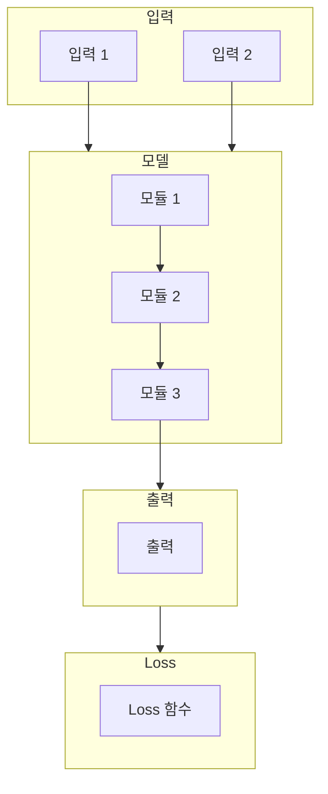

# Paper — {{Title}}

## 메타

- **저자**:
- **Venue / Year**:
- **Link**: arXiv / DOI
- **Code**: (GitHub URL 또는 "미공개")
- **Tier**: ⭐ Must-cite / Should-cite / Skim
- **관련 프로젝트**: [[../../1_Projects/Project_X/README]]

## TL;DR (3줄)

1.
2.
3.

## 핵심 아키텍처

## 문제 정의 (Problem)

## 핵심 아이디어 (Method)

## 실험 결과 (Results)

| 셋업 | 메트릭 | 값 |
|-----|--------|-----|
|     |        |     |

## 강점 / 약점

**Strengths**

-

**Weaknesses**

-

## 우리 연구와의 연결 고리

- Project A:
- Project B:

## 인용할 만한 문장

> "..."

## 추가로 읽을 참고문헌

- [ ]
